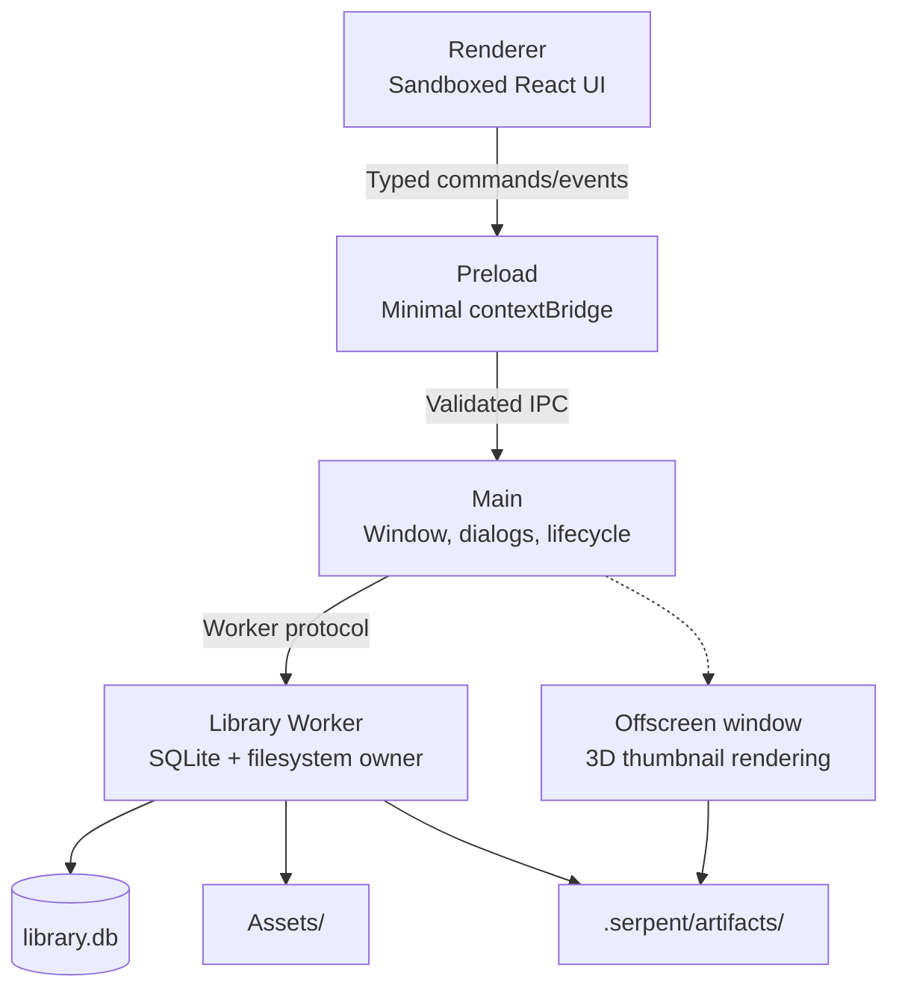

# Architecture

## Process model

```
Renderer (sandboxed, no Node)
  │ typed commands/events only
  ▼
Preload (minimal bridge, contextIsolation)
  ▼
Main (window + dialogs + process lifecycle)
  ▼
Library Worker (UtilityProcess; filesystem + SQLite owner)
```



Invariants:

- The Renderer never gets arbitrary path or SQL capabilities
- Main never opens the library database or scans asset directories
- The Library Worker is the sole owner of the database and file operations
- All cross-process I/O is validated with Zod at runtime

A hidden offscreen window (owned by Main) renders 3D model thumbnails.

## Tech stack

Electron + TypeScript + SQLite (better-sqlite3, FTS5) + Vite + React. Packaging via electron-forge + Vite multi-entry (main / preload / offscreen / worker / script runtimes).

## Directory layout

```
src/
├── main/          # Electron main: windows, dialogs, lifecycle, custom protocols
├── preload/       # contextBridge
├── renderer/      # React renderer
├── worker/        # Library Worker: SQLite, filesystem, import/search/thumbnail pipelines
├── scripting/     # script runtime and plugin hosts
├── shared/        # cross-process: protocols, types, validation schemas
└── automation/    # automation Gateway / MCP
scripts/           # build, media, packaging, release scripts
resources/         # runtime resources (media binaries, ufbx WASM, icons)
tests/
├── unit/          # pure unit tests (Node ABI)
├── worker/        # worker integration tests (Electron ABI)
└── e2e/           # Playwright E2E (dev and packaged)
docs/              # documentation (this tree, ADRs, specs, QA)
```

## Data layer

- Each library is one SQLite database (`.serpent/library.db`) with versioned schema migrations (`MIGRATIONS`, currently v33)
- Asset files live in `Assets/`; derived data (thumbnails/proxies) in `.serpent/artifacts/`
- **Data-compatibility discipline**: migrations are add-only (no dropping/renaming existing tables, columns, indexes or triggers); new builds must open old libraries (lenient reads — missing columns degrade to defaults, never crash); Desktop does not offer read-only libraries — damage is repaired from backups then Assets rescue. Library availability is the hardest baseline: any library-related change must fully run `npm run test:library-availability`. See [ADR-0028](../internal/adr/0028-schema-compatibility-read-only-degrade.md) and `docs/internal/implementation/0031-schema-compatibility-guarantee.md`

## Media pipeline

- Thumbnails / video proxies / audio proxies: Worker queues → Main/child processes (FFmpeg/OIIO) → written back to artifacts
- FBX: ufbx WASM conversion → GLB (cached) → rendered via GLTFLoader
- 3D thumbnails: Worker queues → Main offscreen window renders → PNG written back

## Extension system

Plugins (sandboxed UI + Host API), automation scripts (isolated QuickJS), and MCP (Desktop-embedded loopback Streamable HTTP) — see the [extension author manual](../manual/README.md).

## Key design decisions

- Process isolation and least privilege: no Node in the Renderer, Main never touches the database
- Data compatibility is a release-level gate (Serpent-033e / ADR-0028 / 0031)
- Native-platform builds only (no cross-packaging); the release pipeline carries end-to-end gates
