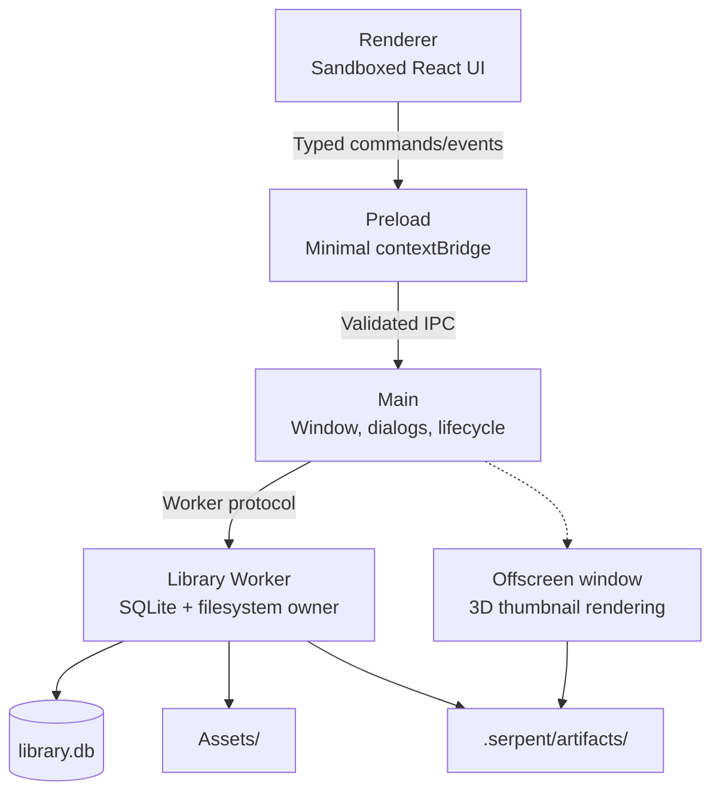

# 架构

## 进程模型

```
Renderer (sandboxed, no Node)
  │ typed commands/events only
  ▼
Preload (minimal bridge, contextIsolation)
  ▼
Main (window + dialogs + process lifecycle)
  ▼
Library Worker (UtilityProcess; filesystem + SQLite owner)
```



不变量：

- Renderer 永远不接收任意路径读写或 SQL 能力
- Main 不打开资源库数据库、不扫描资产目录
- Library Worker 是数据库与文件操作的唯一所有者
- 所有跨进程 I/O 经 Zod 运行时校验

另有一个隐藏 offscreen 窗口（Main 持有），用于 3D 模型缩略图离屏渲染。

## 技术栈

Electron + TypeScript + SQLite（better-sqlite3，FTS5）+ Vite + React。构建用 electron-forge + Vite 多入口（main / preload / offscreen / worker / 脚本运行时）。

## 目录结构

```
src/
├── main/          # Electron 主进程：窗口、对话框、进程生命周期、自定义协议
├── preload/       # contextBridge 桥
├── renderer/      # React 渲染器
├── worker/        # Library Worker：SQLite、文件操作、导入/搜索/缩略图管线
├── scripting/     # 脚本运行时与插件 Host
├── shared/        # 跨进程共享：协议、类型、校验 schema
└── automation/    # 自动化 Gateway / MCP
scripts/           # 构建、媒体、打包、发布脚本
resources/         # 运行时资源（媒体二进制、ufbx WASM、图标）
tests/
├── unit/          # 纯单元测试（Node ABI）
├── worker/        # Worker 集成测试（Electron ABI）
└── e2e/           # Playwright E2E（dev 与 packaged）
docs/              # 文档（本目录、ADR、实施规格、QA）
```

## 数据层

- 每个资源库一个 SQLite 数据库（`.serpent/library.db`），schema 版本化迁移（`MIGRATIONS`，当前 v33）
- 资产文件存 `Assets/`，派生数据（缩略图/代理）存 `.serpent/artifacts/`
- **数据兼容纪律**：迁移只加不改（禁删改现有表/列/索引/触发器）；新代码必须能打开旧库（宽容读取：缺列降级默认值，不崩溃）；只读降级是最后兜底。见 [ADR-0028](../internal/adr/0028-schema-compatibility-read-only-degrade.md) 与 `docs/internal/implementation/0031-schema-compatibility-guarantee.md`

## 媒体管线

- 缩略图/视频代理/音频代理：Worker 排队 → Main/子进程处理（FFmpeg/OIIO）→ 写回 artifacts
- FBX：ufbx WASM 转换 → GLB（缓存）→ GLTFLoader 渲染
- 3D 缩略图：Worker 入队 → Main offscreen 窗口渲染 → PNG 写回

## 扩展体系

- 插件（sandboxed UI + Host API）、自动化脚本（QuickJS 隔离）、MCP（Desktop 内嵌 loopback Streamable HTTP）——详见[扩展作者手册](../manual/README.md)

## 关键设计决策

- 进程隔离与最小权限：Renderer 无 Node、Main 不碰数据库
- 数据兼容为发布级门禁（Serpent-033e / ADR-0028 / 0031）
- 平台原生构建（无交叉打包），发布流水线带全链路门禁
