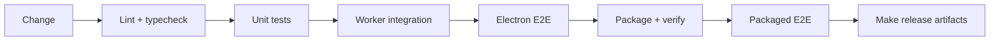

# Build & Packaging

## Basic commands

```bash
npm run package          # package the app (includes build) → out/Serpent-<platform>-<arch>/
npm run make             # build installers → out/make/ (macOS dmg / Windows zip; Windows setup built with Inno Setup)
npm run verify:package   # verify the packaged output (ASAR, native modules, media)
```

`package`/`make` run mandatory pre-hooks:

- Media binaries (`media-binaries verify` — provenance and hashes)
- ufbx WASM (`verify-ufbx-wasm` — hash-locked via `scripts/ufbx-wasm-lock.json`)
- Packaged output (`verify:package`: ASAR, better_sqlite3.node, Host utilities)

`package`/`make` update the dev Electron binary — run `npm run rebuild:native` afterwards.

## Release pipeline (release:local)

One command for the full flow:

```bash
npm run release:local
```

Phases: `verify` → `media` → `package` → `e2e` → `make` → `checksums`

| Phase | What it does |
| --- | --- |
| verify | `rebuild:native` + `verify:mainline` (same gates as CI) |
| media | download the controlled media bundle (`media:acquire`) + verify |
| package | `electron-forge package` + `verify:package` |
| e2e | packaged startup tests (`test:e2e:packaged`) |
| make | build installers |
| checksums | SHA-256 manifests (versioned header) |

Skip slow phases with `--skip-verify` / `--skip-media` / `--skip-e2e`. Run one phase with `npm run release:<phase>` (the e2e phase is `npm run release:e2e:packaged`).



### Local trial without media promotion

The media bundle must be "promoted" (built and registered in `bundle-lock.json` with an immutable URL + hashes) before the formal pipeline runs. If local artifacts already match `source-lock.json`, you can skip provenance:

```bash
SERPENT_MEDIA_SKIP_PROVENANCE=1 npm run release:local -- --skip-verify --skip-media
```

> `SKIP_PROVENANCE` is for local trials only. Formal releases must go through promotion.

Another local path is `--build-media-locally`: build the full media bundle on this machine with vcpkg (`scripts/media-build/*`, takes 1-3 hours) and let the gates use the local artifacts:

```bash
npm run release:local -- --skip-verify --build-media-locally
```

### Versions

- Version lives in `package.json` (semver)
- Bump with `npm version patch|minor|major` (tags automatically)
- Every pipeline run prints `Serpent v<version>`; checksum manifests carry the version header

### Platforms

`forge.config.ts` enforces **native-platform builds** (allowlist `darwin-arm64` / `win32-x64`) — media binaries, ufbx and native modules are platform-specific; cross-packaging is not supported. Windows runs the same pipeline on a Windows host.

### Windows installer (Inno Setup)

The Windows installer `SerpentSetup.exe` is built with **Inno Setup** (same approach as VS Code; script `assets/inno/serpentsetup.iss`):

```bash
# package first (Inno packs from out/Serpent-win32-x64), then compile:
& "$env:LOCALAPPDATA\SerpentTools\inno\tools\ISCC.exe" assets\inno\serpentsetup.iss
```

- Multilingual: language selection dialog on launch (defaults to the system language), English + Simplified Chinese
- Wizard with install-path selection (default `C:\Program Files\Serpent`), Start Menu / desktop shortcuts
- Per-machine install (UAC elevation), automatic uninstaller `unins000.exe` and Apps & Features entry
- Getting Inno Setup: NuGet package `Tools.InnoSetup` (no admin needed, extract and use), see CLAUDE.md

> History: Squirrel (no wizard / no path selection / uninstall leftovers) and WiX MSI (MSI language switching requires a custom bootstrapper, confirmed by the community) were both tried and rolled back — see `docs/internal/development/2026-08-08-windows-packaging-and-squirrel-installer-development-log.md`.

## Media binary promotion (Serpent-Build)

Media bundles (FFmpeg/OpenImageIO) are distributed via GitHub Releases on the
[Serpent-Build](https://github.com/dolag233/Serpent-Build) repo (immutable URL +
SHA-256); main-repo `release:media` downloads and verifies them:

1. **Build once** (not in CI):
   - `ffmpeg/ffprobe`: BtbN LGPL builds (`registry.npmmirror.com/-/binary/ffmpeg-builds/`
     `ffmpeg-<ver>-win32-x64-lgpl.tar.xz`, or the macOS variant), LGPL-only (no GPL markers)
   - `oiiotool`: `scripts/media-build/build-oiiotool-win32.ps1` (Windows) /
     `darwin-arm64.sh` (macOS) — vcpkg build (pinned toolchain + registry commit)
2. **Package and upload**:
   ```bash
   # assemble zip (platform layer ffmpeg/<platform>/…) + sha256
   # upload (create/reuse Release media-v<ver> + assets + publish):
   node scripts/release/publish-media-bundle.mjs --platform win32-x64 \
     --version v0.1.1 --zip artifacts/media-binaries/serpent-media-win32-x64.zip
   ```
3. **Promote in main repo**: set the platform entry in
   `resources/media-binaries/bundle-lock.json` to
   `{status: ready, url, sha256, size, manifestSha256}` (script prints the entry).

> Versioning: bundle versions are independent of app versions (`media-vX.Y.Z`);
> Releases use GitHub Immutable Releases (assets immutable, tags non-reusable).

## Browser extension

The extension ships inside the app bundle (`Resources/extension`), not via a store:

```bash
npm run extension:build   # builds dist/extension
```

`prePackage` rebuilds it automatically. Manual loading instructions are in the [user guide](../user-guide/installation.en.md).

## Signing

- **macOS**: currently ad-hoc signed (`osxSign.identity: '-'` — required on Apple Silicon; does not clear the Gatekeeper warning). Swap the identity for a Developer ID and add `osxNotarize` once you have a certificate
- **Windows**: currently unsigned (SmartScreen warning). For formal releases, SignPath free signing (same as VSCodium) or a commercial certificate

## Release prerequisites (in progress)

1. **Media promotion**: toolchain repo (Release attachments + `versions.json`) to remove the `SKIP_PROVENANCE` need
2. **Windows native validation**: same pipeline on a Windows host + install/uninstall journey
3. **Signing upgrade**: SignPath application / Apple Developer account
4. **CI/CD**: GitHub Actions tag-driven + platform matrix + draft → release

See the research doc for details.
