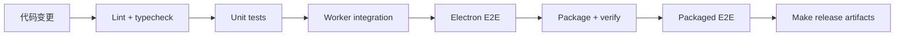

# 构建与打包

## 基础命令

```bash
npm run package          # 打包应用（含构建）→ out/Serpent-<platform>-<arch>/
npm run make             # 生成安装包 → out/make/（dmg / squirrel / zip）
npm run verify:package   # 校验打包产物（ASAR、native 模块、媒体组件）
```

`package`/`make` 的 prepackage/premake 钩子强制校验：

- 媒体二进制（`media-binaries verify`，来源与哈希）
- ufbx WASM 产物（`verify-ufbx-wasm`，哈希锁 `scripts/ufbx-wasm-lock.json`）
- 打包产物完整性（`verify:package`：ASAR、better_sqlite3.node、Host utilities）

`package`/`make` 会更新 dev 的 Electron binary，跑完执行 `npm run rebuild:native` 恢复。

## 发布流水线（release:local）

一键全流程：

```bash
npm run release:local
```

阶段：`verify` → `media` → `package` → `e2e` → `make` → `checksums`

| 阶段 | 内容 |
| --- | --- |
| verify | `rebuild:native` + `verify:mainline`（与 CI 相同门禁） |
| media | 从受控 URL 下载媒体包（`media:acquire`）+ 校验 |
| package | `electron-forge package` + `verify:package` |
| e2e | 对打包产物跑启动测试（`test:e2e:packaged`） |
| make | 生成安装包 |
| checksums | 产物 SHA-256 manifest（带版本头） |

跳过慢阶段的选项：`--skip-verify` / `--skip-media` / `--skip-e2e`。单独跑某阶段：`npm run release:<phase>`（e2e 阶段为 `npm run release:e2e:packaged`）。



### 本地试跑（无媒体晋升时）

媒体包需先"晋升"（构建产物登记进 `bundle-lock.json` 的不可变 URL + 哈希）才能走正式流水线。本地已有匹配 `source-lock.json` 的产物时，跳过 provenance 校验：

```bash
SERPENT_MEDIA_SKIP_PROVENANCE=1 npm run release:local -- --skip-verify --skip-media
```

> `SKIP_PROVENANCE` 只用于本地试跑，正式发布必须走晋升流程。

另一条本地路径是 `--build-media-locally`：在本机用 vcpkg 完整构建媒体组件（`scripts/media-build/*`，耗时 1-3 小时）后自动以本地产物放行门禁：

```bash
npm run release:local -- --skip-verify --build-media-locally
```

### 版本

- 版本号在 `package.json`，semver 格式
- 提升：`npm version patch|minor|major`（自动打 tag）
- 每次流水线运行输出 `Serpent v<版本>`；checksum manifest 带版本头

### 平台

`forge.config.ts` 强制**原生平台构建**（`darwin-arm64` / `win32-x64` 白名单）——媒体二进制、ufbx、native 模块均为平台相关，不支持交叉打包。Windows 需在 Windows 原生环境跑同一流水线。

## 浏览器扩展

扩展不通过商店上架，构建后内嵌进应用包（`Resources/extension`）：

```bash
npm run extension:build   # 构建 dist/extension
```

`prePackage` 自动重建扩展。用户手动加载方式见[使用手册](../user-guide/installation.md)。

## 签名

- **macOS**：当前 ad-hoc 签名（`osxSign.identity: '-'`，Apple Silicon 必需，不消除 Gatekeeper 警告）。拿到 Developer ID 证书后替换 identity 并补 `osxNotarize`
- **Windows**：当前未签名（SmartScreen 警告）。正式发布建议 SignPath 免费签名（VSCodium 同款）或商业证书

## 发布前置（进行中）

1. **媒体晋升**：工具链仓库（Release 附件 + `versions.json`），解除 `SKIP_PROVENANCE`
2. **Windows 原生验证**：同一流水线在 Windows 环境跑通 + 安装/卸载旅程
3. **签名升级**：SignPath 申请 / Apple Developer 账号
4. **CI/CD**：GitHub Actions tag 驱动 + 平台 matrix + draft → 正式 release

详见[研究文档](../internal/research/2026-08-08-local-release-packaging.md)。
