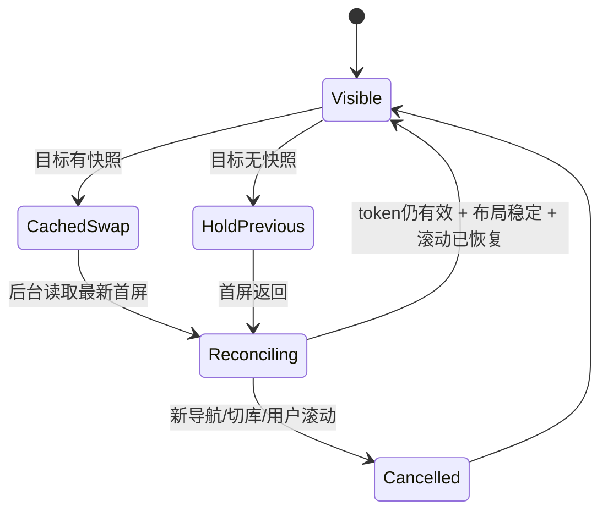

# 工作区标签页导航与无闪烁切换算法

> 日期：2026-09-12
>
> 父工单：`Serpent-738426`
>
> 基线：`83ee70f8`
> 状态：设计冻结，等待分步实现

## 1. 要解决的问题

现有标签模型已经能保存页面、搜索、选择和滚动位置，但导航过程仍由 `App.tsx`
中的多组异步函数分别写 React 状态。由此产生三类问题：

1. 慢请求返回时只校验资源库，不能证明发起请求的标签仍是当前标签。旧的文件夹、
   合集、智能合集或搜索响应可能覆盖后来选择的标签，并把旧页面写入新标签历史。
2. 标签恢复、前进/后退和普通导航各有队列或 generation，却共享全局
   `suppressNavHistoryRef`。两条恢复并发时，旧流程可能提前解除抑制或覆盖新视图。
3. 导航开始时先 `setAssets([])`、切换页面标志，再等待首屏数据。标签切换期间会
   绘制一次空画布，表现为白闪；数据回来后再恢复滚动，还可能出现从顶部跳到目标
   位置的一帧。

本设计把“用户要去哪里”“异步读取”“何时提交画面”“历史如何变化”分开，所有
可见导航统一走同一条事务管线。

## 2. 不变量

实现必须始终满足：

- 一个标签拥有一份独立历史、浏览条件、选择、滚动书签和最近渲染快照。
- 只有加号创建标签；侧栏、面包屑、查看器、搜索和前进/后退都在当前标签内工作。
- 标签切换不新增历史，也不改变目标标签的 history index。
- 普通导航先保存当前历史条目的视口，再截断 forward 分支并 push 新条目。
- 后退/前进先保存离开条目的视口，只移动 index，不 push 或 replace 目标条目。
- 关闭非活动标签不属于可见导航，不能使活动标签正在执行的查询失效。
- 任何异步结果只有同时匹配资源库、标签和该标签最新导航代次时才能提交。
- 目标首屏和目标滚动位置准备好以前，当前画布不得被清空；切换过程中不能出现
  纯白帧或先落顶部再跳转的一帧。
- 资源库切换或关闭会清空全部标签快照和导航 token，旧库结果永远不能写入新库。
- 不增加“关闭右侧标签页”。

## 3. 状态模型

### 3.1 标签会话

在现有 `WorkspaceTabSession` 上增加轻量渲染快照。快照只保存首屏所需的结构化
数据和虚拟布局，不复制缩略图二进制或媒体句柄。

```ts
interface WorkspaceTabSession {
  id: string;
  history: WorkspaceNavHistory;
  browseState: WorkspaceTabBrowseState | null;
  selectedAssetIds: string[];
  selectedAssetId: string | null;
  cachedTitle: string | null;
  renderSnapshot: WorkspaceRenderSnapshot | null;
}

type WorkspaceRenderSnapshot =
  | {
      kind: "browse";
      items: AssetSummary[];
      layout: BrowseLayoutEntry[];
      total: number;
      snippets: Array<[string, string]>;
      pageDescriptor: BrowsePageDescriptor;
    }
  | {
      kind: "trash";
      items: AssetSummary[];
      folders: TrashedFolderSummary[];
      layout: BrowseLayoutEntry[];
      total: number;
    }
  | { kind: "tag-management" }
  | { kind: "plugin-sidebar"; viewId: string };
```

`renderSnapshot` 是内存缓存，不持久化到数据库或偏好文件。关闭标签立即释放；
关闭/切换资源库全部释放。每个标签最多保存现有首屏窗口和虚拟布局，不能保存文件
内容、Blob、解码后位图或无限分页结果。

### 3.2 历史条目与视口书签

每个历史条目继续独立拥有视口。建议把当前三元组扩展为带锚点的书签：

```ts
interface WorkspaceNavViewport {
  scrollTop: number;
  scrollProgress: number;
  scrollExtent: number;
  anchor?: {
    kind: "asset" | "folder";
    id: string;
    offsetFromViewportTop: number;
  };
}
```

恢复优先级：

1. 新旧 `scrollExtent` 相同或差异在 1px 内时使用精确 `scrollTop`。
2. 布局改变且锚点仍存在时，让锚点回到原来的 viewport 内偏移。
3. 锚点不存在时使用 `scrollProgress * newScrollExtent`。
4. 目标没有滚动范围时落在 0。

该顺序既满足同一布局下的像素级返回，也允许窗口宽度、卡片尺寸或虚拟布局变化后
回到同一内容位置。

## 4. 导航协调器

新增纯 TypeScript 模块 `workspace-navigation-coordinator.ts`。它只管理代次和提交
资格，不读写 React 状态。

```ts
interface WorkspaceNavigationToken {
  libraryEpoch: number;
  tabId: string;
  tabGeneration: number;
  historyMode: "push" | "replay" | "none";
}

interface WorkspaceNavigationCoordinator {
  activateTab(tabId: string): void;
  begin(tabId: string, historyMode: WorkspaceNavigationToken["historyMode"]): WorkspaceNavigationToken;
  isCurrent(token: WorkspaceNavigationToken): boolean;
  invalidateLibrary(): void;
}
```

`isCurrent` 必须同时检查：

```ts
token.libraryEpoch === currentLibraryEpoch &&
token.tabId === activeTabId &&
token.tabGeneration === generationByTab.get(token.tabId)
```

代次按标签维护，不能只用一个全局数字。操作分类如下：

| 操作 | 是否切换 activeTab | 是否推进目标标签 generation | historyMode |
| --- | --- | --- | --- |
| 当前标签内普通导航/搜索 | 否 | 是 | `push`，搜索为 `none` |
| 选择另一个标签 | 是 | 是 | `none` |
| 新建并激活标签 | 是 | 是 | `none` |
| 后退/前进 | 否 | 是 | `replay` |
| 关闭活动标签并激活邻居 | 是 | 是 | `none` |
| 关闭最后标签并复位 All | 否 | 是 | `none` |
| 关闭非活动标签 | 否 | 否 | 无 token |
| 关闭其他标签且保留当前活动标签 | 否 | 否 | 无 token |
| 切换/关闭资源库 | 重置 | 全部失效 | 无 |

这条分类专门避免一个已确认的问题：关闭非活动标签时不能取消活动智能合集或防抖
搜索，否则查询结果会被丢弃并留下空画布。

## 5. 两阶段导航事务

所有页面入口最终调用同一个控制器，而不是直接调用 `chooseFolder`、
`chooseCollection` 等会写全局状态的函数。

```ts
async function navigate(intent: WorkspaceNavigationIntent) {
  captureOutgoingTab();
  const token = coordinator.begin(intent.tabId, intent.historyMode);
  stageTabActivation(intent, token);

  const prepared = await prepareWorkspaceView(intent, token);
  if (!coordinator.isCurrent(token)) return;

  commitPreparedWorkspaceView(prepared, token);
  await restoreViewportBeforeReveal(prepared.viewport, token);
}
```

### 5.1 capture

- 同步保存当前 history entry 的 viewport。
- 保存浏览条件、选择和当前 `WorkspaceRenderSnapshot` 到离开的标签。
- `push` 导航在 capture 后修改当前标签历史；`replay` 已由 back/forward 移动 index；
  `none` 不改历史。

### 5.2 prepare

`prepareWorkspaceView` 只读取数据并返回 `PreparedWorkspaceView`，不得调用任何 React
setter。现有 `loadContent`、`executeSearchDefinition`、合集和智能合集读取应逐步改为
返回值形式。侧栏 hydration 可以继续渐进，但必须绑定 `libraryEpoch`，且不能覆盖
画布事务。

```ts
interface PreparedWorkspaceView {
  token: WorkspaceNavigationToken;
  location: WorkspaceNavLocation;
  browseState: WorkspaceTabBrowseState;
  selection: WorkspaceSelectionSnapshot;
  renderSnapshot: WorkspaceRenderSnapshot;
  viewport: WorkspaceNavViewport;
}
```

### 5.3 commit

导航关键状态放进一个 reducer slice，通过一次 `COMMIT_PREPARED_VIEW` 更新页面类型、
scope、资产、总数、snippets、分页 descriptor、选择和加载状态。禁止在 await 前
`setAssets([])`，也禁止请求完成后再由多个 effect 分批补写页面身份。

history 的写入由 token 的 `historyMode` 决定，不能使用全局布尔
`suppressNavHistoryRef`：

- `push`：成功 commit 后 push 目标；失败不产生幽灵历史。
- `replay`：只提交画面，history index 已经移动。
- `none`：标签恢复或搜索刷新，不写 history。

## 6. 无闪烁切换

视图状态增加 `visibleView` 和 `pendingView` 两层：

```ts
interface WorkspaceViewTransitionState {
  visibleView: WorkspaceCommittedView;
  pendingView: { token: WorkspaceNavigationToken; location: WorkspaceNavLocation } | null;
}
```

切换算法：

1. 点击标签时立即更新活动标签样式和 `aria-selected`。
2. 若目标有 `renderSnapshot`，在同一 reducer action 中把快照变成新的
   `visibleView`；首帧直接显示目标旧内容，再后台 reconcile。
3. 若目标没有快照，保持原 `visibleView`，设置 `aria-busy=true` 并用透明的输入
   拦截层阻止用户操作旧内容。不能清空数组或改成白色占位。
4. 首屏数据返回后一次性替换 `visibleView`。`useLayoutEffect` 在浏览区域重新显示前
   完成 scroll restore；虚拟布局未给出稳定 extent 时继续保持旧画面。
5. 连续两帧 extent 不再变化，或目标锚点已可定位时，设置最终 scrollTop 并清除
   `pendingView`。用户在等待期间发生 wheel、touch、pointer 或导航键输入时取消自动
   恢复，以用户输入为准。
6. 只有超过 300ms 的冷切换才允许显示低干扰的主题色进度提示；不得出现白底遮罩。



## 7. 前进、后退与查看器语义

- direct A → B：保存 A 视口，截断 A 后方分支，push B，B 初始视口为 0。
- Back B → A：保存 B 视口，index - 1，读取 A，恢复 A 自己的书签。
- Forward A → B：保存 A 当前视口，index + 1，读取 B，恢复 B 自己的书签。
- 标签 X → Y → X：只保存 X 当前条目并激活 Y；X 的 index、entries 和每条 viewport
  均不变化。
- 打开查看器：push `preview(assetId)`；查看器内切资产 replace 当前 preview。
- 查看器 X/Esc：dismiss 当前 preview 并恢复其下浏览条目的视口。
- 在查看器内用 Back：history 先退到浏览条目，关闭查看器时不得再次 dismiss 新的
  current entry。

验收数据必须使用两个不同位置：例如根目录 73%、文件夹 41%。只检查页面标题不能
证明 forward 的视口语义。

## 8. 竞态与失败处理

- 每个异步分支在每次 await 后、任何 React/分页/历史写入前调用 `isCurrent(token)`。
- 更稳妥的最终形态是 prepare 阶段零写入；token 只需在最终 commit 检查一次，
  分页和侧栏后台任务仍各自检查。
- 新导航应 Abort 可取消的读取；不能取消的 Worker 调用允许自然结束，但结果丢弃。
- 失败只在 token 仍有效时显示错误。旧请求失败不得覆盖新页面通知。
- 活动导航失败时保留之前 `visibleView`，移除 pending 状态并显示可重试提示；不得
  清空画布。
- 搜索拥有同一标签下的 discovery generation，并同时携带导航 token。恢复标签后
  触发的 200ms 防抖搜索只能恢复该标签自己的选择；用户随后修改搜索会使旧恢复
  selection 失效。

## 9. 测试矩阵

### 单元测试

- coordinator：慢 A 后发 B，A 不可 commit；切库后全部 token 失效。
- coordinator：关闭非活动标签不改变活动标签 token；关闭活动标签会创建邻居 token。
- history：A=73%、B=41%，Back 恢复 73%，Forward 恢复 41%；resize 时 anchor 优先，
  anchor 缺失时 progress fallback。
- render cache：按 tabId 隔离；关闭标签释放；切库清空；不接受 Blob/无限分页数据。
- controller：restore、back/forward、普通导航只能有一个 current token；不存在共享
  history suppression 布尔值。

### Renderer 集成测试

- 人工延迟目标读取，切标签后旧请求不能改目标标签 scope、items、selection、history。
- 在活动智能合集读取期间关闭非活动标签，结果仍能正常提交。
- 目标有缓存时，点击到首个 requestAnimationFrame 之间始终有目标卡片。
- 目标无缓存时保留旧画面并拦截输入，首屏 ready 后一次替换。
- 防抖搜索提交后仍恢复目标标签的 selected asset。

### Electron E2E

- 只有加号增加标签；普通导航保持数量。
- 根目录滚到 73%，文件夹滚到 41%；Back/Forward 分别断言两个比例。
- 在空合集与有资产文件夹间切换，用逐帧 probe 断言活动标签生效后没有空白帧。
- 快速点击 A/B/A，加一个可控慢查询，最终标题、scope、资产、选择和历史都属于 A。
- 右键只有“关闭标签页”“关闭其他标签页”，不存在“关闭右侧标签页”。
- 每次 E2E 使用隔离 userData/临时资源库并在进程退出后清理。

## 10. 实施边界

- 第一阶段只做纯模型和单元测试，不编辑 `App.tsx`。
- 第二阶段只做 render snapshot/cache 模型和单元测试，不接 UI。
- 第三阶段集中修改 `App.tsx`，接入 coordinator、prepare/commit 和无闪烁切换；避免
  多个 agent 同时编辑巨型文件。
- 第四阶段补 Electron E2E、验收矩阵和真实应用检查。
- 现有文件夹式标签 UI、右键菜单和样式不在本算法改造范围内。

## 11. 工单与交付顺序

| 顺序 | 工单 | 可并行 | 主要文件边界 | 完成门槛 |
| --- | --- | --- | --- | --- |
| A | `Serpent-ea5c9c` 导航协调器 | 与 B 并行 | 新 coordinator、`use-workspace-tabs.ts`、单测；不碰 `App.tsx` | per-tab token 与关闭分类测试通过 |
| B | `Serpent-58467e` 渲染快照缓存 | 与 A 并行 | 新 render cache/model、单测；不碰 `App.tsx` | 隔离、释放、内存边界测试通过 |
| C | `Serpent-bb3ce7` 两阶段集成 | 等待 A+B | 独占 `App.tsx`，接入 A+B | 所有入口走 prepare/commit；无全局 suppress；定向单测通过 |
| D | `Serpent-83d71f` E2E/QA | 等待 C | E2E、开发日志、QA、验收清单 | 竞态、空白帧、73%/41% 前后退均有证据 |

依赖已经写入 `.beads/issues.jsonl`：C 被 A、B 阻塞；D 被 C 阻塞；父工单
`Serpent-738426` 被 D 阻塞。A、B 适合分给两个便宜 agent 并行；C 必须只给一个
agent，防止多人同时修改 `App.tsx`；D 在 C 完成后单独执行。
