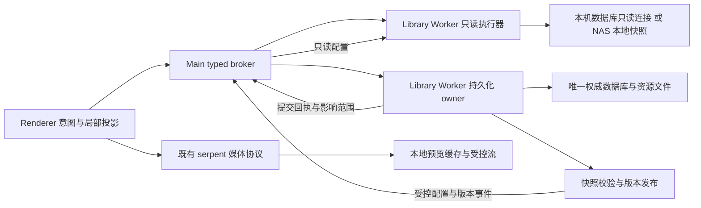

# 文件夹切换、NAS、资源加载与刷新：交互性能第二阶段

> 2026-09-13；设计基线 `b2ece599`（dev，0.2.1）。
> 状态：顶层设计与实施拆分；未实现、未做本轮性能验收。
> 本文是 [0032 性能架构](0032-library-performance-architecture.md) 的续篇；保留原产品目标，替换其「单个执行线程内调度足以保证交互」的实现假设。执行边界见 [ADR-0033](../adr/0033-isolated-catalog-reads.md)。
> 工单与模型分工见 [执行安排](../development/2026-09-13-interactive-performance-execution.md)。

## 1. 问题与本轮结论

用户报告：切文件夹非常卡；NAS 资源库整体慢；资源加载慢；新增文件夹约两秒后才看到反馈。本轮要同时缩短实际工作耗时与反馈延迟，并使后台工作无法阻塞当前浏览。

当前代码已经有分页、BrowseSession、过期响应保护、优先级调度、网络元数据快照、预览字节缓存和异步对账。继续分别增大并发、加 debounce 或延长超时不能建立端到端保证。本轮确定四个设计方向：

1. **将可丢弃的交互读从唯一持久化写入执行线程分离**，Main 可以直接投递只读语义请求，写线程忙时也不需要它中转。
2. **先读取有界首屏，再生成全范围索引、准确计数与几何**；不能为了显示 100 项先枚举 10 万 ID。
3. **NAS 使用本地版本化目录快照和预览缓存**；缓存更新在后台，不能因普通 job 写入把交互读取重新推回 SMB。
4. **变更反馈与对账分开**：保留真实提交中状态；持久提交后直接应用受影响实体，不等待整库导航、计数与搜索重跑。

这些是基于代码结构作出的架构选择，**不是本轮实测根因结论**。具体耗时贡献、平台收益与最终参数必须由 PERF2-01 的基线和后续对照证明。

## 2. 已核对的代码事实

行号对应设计基线，实施时随迁移更新四列证据；文件和符号是长期定位入口。

| 事实 | 代码/历史证据 | 对设计的约束 |
| --- | --- | --- |
| 会话创建先全范围 `idsOnly`，再取首屏 | `src/worker/library-service.ts:30906`，`createBrowseSession` | 首屏不只承担 LIMIT 查询成本；必须拆开两种工作 |
| scheduler 仅控制尚未开始的工作；不强杀活动操作 | `src/worker/interactive-scheduler.ts:87` | 同线程 priority 无法抢占同步 SQLite/文件调用 |
| NAS cache 与 primary 仍在同一 Worker；transaction/run/exec 会移除快照读连接 | `src/worker/network-metadata-cache.ts:1180`，`createNetworkReadThroughConnection`；`library-service.ts:27850` | SQL 分类适配器不是读执行隔离；缓存需要独立寿命与发布契约 |
| 新建文件夹返回完整 summary，但 inline edit 成功后仍调用全内容 reload | `src/renderer/use-inline-folder-edit.ts:149`；`src/worker/library-service.ts:12307` | 已有 submitting 防重与 summary 可复用，不能再造一套创建流程；UI 应直接使用提交结果 |
| 预览镜像命中前仍先等待 artifact 路径解析 | `src/main/index.ts:7814`，`resolveArtifactPathBatched` → `PreviewCache.locateSync` | 本地有字节也可能在 Worker 路径请求前排队 |
| `asset.changed` 合并后仍可能重跑 reload；NAS library.changed 也安排 reload | `src/renderer/App.tsx`，`scheduleSilentReload` / `scheduleNetworkLibraryReload` | 防抖减少次数，未缩小每次工作范围 |
| 20k 本地冷跳转历史严格 500ms 未稳定通过 | `Serpent-sa65` 2026-08-26/27；D.6 开发日志 | 不能把首批图出现、最终全解码或局部 SQL 快写成全部可见图片通过 |
| D.7 已有 Online Backup 和版本发布，真实 NAS 验收不足 | D.7 开发日志；`Serpent-08a344` | 复用快照发布/锁/校验，不重复实现缓存产品 |

历史工单中存在 10k 旧口径、只统计已挂载 img 的撤回结果和已被后续代码替换的描述。实施以当前代码及本轮测量为准，不按旧工单估算秒数。

## 3. 用户行为与指标

### 3.1 必须覆盖的行为

1. 点击文件夹，名称和选中范围立即响应，内容属于刚选中的范围。
2. 从耗时的「所有资产」立刻切到小文件夹，小文件夹不等待旧任务完成。
3. 连续 A→B→C、后退/前进和多窗口操作，迟到结果不覆盖最新视图。
4. 导入、元数据提取、watcher 或同步运行时仍能切换和浏览。
5. 新建托管/链接子文件夹时立即看到提交中状态；失败保留名称并可修改重试。
6. 成功后的新文件夹直接出现在当前父目录和侧栏，不能等待全库刷新才出现。
7. 改名、移动、删除、恢复后的 UI 与真实提交一致；旧请求不能复活被删实体。
8. NAS 热浏览使用本地数据；普通后台 job 不反复冲掉缓存。
9. NAS 首次冷开、缓存损坏或空间不足可继续走明确的加载/恢复路径，不能冒充空库。
10. NAS 写入成功后立即看到自己的修改；本地快照不能把它覆盖回旧状态。
11. 同一库按产品支持方式在设备间交接后，新设备不会永远停在旧快照。
12. 手动刷新能发现外部新增、删除、移动；不能因优化遗漏不可见目录。
13. 缩略图热缓存跨重启有效；变更 revision、切库、删库后旧授权失效。
14. 首批、全部可见解码、查看器高清和全库后台任务完成分别报告。

### 3.2 计时边界

| 指标 | 起止 | 目标/判定 |
| --- | --- | --- |
| 操作确认 | 输入事件 → 下一个可观察的选中/提交中状态绘制 | 新目标 ≤100ms；不代表磁盘成功 |
| 文件夹首屏 | 导航意图 → 正确范围首批 summary 实际绘制 | 沿用 ≤500ms；热/冷、NAS/本地分别记录 |
| 搜索首屏 | 固定 token 意图 → 正确范围结果绘制 | 沿用 ≤1s |
| 新请求抢占 | 新文件夹意图 → 新范围首屏 | 受控旧读阻塞场景 ≤500ms；旧读不再串行挡路 |
| 变更投影 | 成功响应进入 Renderer → 对应实体/计数绘制 | 沿用局部更新 ≤200ms；端到端提交耗时另记 |
| 预览解码 | 视口稳定 → 所有应显示图片真实解码 | 沿用严格 500ms；以几何/资产集合为分母，不只统计已有 img |
| 后台刷新响应性 | 扫描期间发出的小范围浏览 → 绘制 | 同首屏目标；记录扫描总耗时，禁止以无限推迟扫描换绿 |
| 开库/切库 | 用户意图 → 结构一致快照进入主界面 | 遵循 UI-0006：超过3秒才出现简洁等待窗；不提前露出半套库结构 |

测量报告同时记录 p50/p95/max、成功率、冷/热定义、fixture live count、平台、提交和命令。性能目标不变成共享机器每次跑都稳定的断言；测试波动保留失败证据并定位，不靠重跑覆盖。正确性和请求隔离可用受控 barrier 得到确定性断言。

## 4. 执行架构与所有权

### 4.1 单一权威，多条执行路径

Library Worker 仍是领域数据与文件操作的唯一权威。其内部拆出只读执行器（独立 UtilityProcess）：只能运行注册的浏览/计数/几何/目录摘要/媒体描述符查询，不得迁移、恢复、初始化索引、写主库、运行 job、解码媒体、扫描用户目录或接受任意 SQL。复用现有查询编译器，不创建一个带 watcher/queue 的第二份 LibraryService。

Main 只监督生命周期、验证配置并路由语义请求；Renderer/Preload 不得到路径或 SQL。首次注册的数据库/快照配置来自权威 owner，Main 不能接受 Renderer 提供的路径。所有新控制消息、请求和响应都经 Zod 校验。

本地库：owner 先完成已有开库安全门禁，只读执行器再打开同机主库的只读连接。使用短读事务，不持有整个浏览会话的 WAL read lock。WAL 只在本机使用；SQLite 明确说明 WAL 不适用于网络文件系统。[SQLite WAL](https://www.sqlite.org/wal.html)

NAS：只读执行器**只打开已发布到本机的快照**，绝不自行打开 SMB primary。首次无快照时由 owner 引导生成；完成前显示真实加载状态。迁移/结构安全检查继续由 owner 执行。缓存加速不承诺消除首次读取全量元数据或远端写事务的物理成本。

资源库关闭/删除：先增加 generation 并阻止新读，取消媒体流，撤销读配置并等待只读句柄释放，再执行既有 owner 关闭/删除路径。跨窗口库引用保持到最后一个使用者退出。强制结束只读执行器不能变成强杀写进程。

### 4.2 真正的 latest-wins

请求身份至少包含 `libraryId + libraryGeneration + consumerId + interactionGeneration + requestKind`；consumerId 为窗口/浏览表面，不能用库级单键让窗口 A 取消窗口 B。分页、几何、计数共享 session 版本，但各自有请求类型，避免第一页与后续页互相取代。

常规查询通过有界批次让步，检查是否过期。单条正在执行的同步 SQLite 不能靠另一个 JS message 及时取消；不要假设 `LIMIT` 自动保证快速执行，排序/过滤仍可能扫描大量记录。若只读执行器超过协作让步预算且请求已被用户替代，Main 可撤销该执行器并将最新请求交给预热备用执行器。只读任务可重新执行，持久化任务不可采用此策略。

默认最多两个读执行器/应用：一个服务当前交互，一个预热备用；不按文件夹、请求或每个库无界 fork。备用优先持有当前库配置，其它库按有界 LRU（起点每进程4个句柄）接入。启动、退出、连续快速切换须有节流与资源上限；旧进程确认 exit 后才补新备用。多个窗口共享执行器时，被整体撤销的其它有效读请求按各自最新 generation 重投递，不能丢请求或无限重试。

协作让步目标 4–8ms，触发备用接管观察窗起点 50ms；这两个数是待基准校准的调度参数，不是新的磁盘超时。不得因一次慢读终止写 owner，也不得重新引入「等待多少秒就把有效响应丢掉」的超时故障。`utilityProcess` 提供独立进程和终止能力，但进程重启开销须实测。[Electron utilityProcess](https://www.electronjs.org/docs/latest/api/utility-process)

### 4.3 统一读版本

响应携带语义版本 `(libraryGeneration, catalogSequence, snapshotGeneration)`；本地连接无磁盘快照时 snapshotGeneration 可为空。不要混用数据库文件 mtime、通用 job change sequence 和目录可见变更序号。

- `catalogSequence` 沿用窄化后的 browse change sequence；可见元数据、组织关系、忽略规则和资产 revision 的变化必须推进它。
- artifact/job 进度不应让完整目录读缓存失效；媒体 readiness 通过现有专用事件处理。
- 新消费者指定 `minCatalogSequence` 时，返回版本不足必须带 typed `refreshing/stale`，不能把旧数据宣称为该版本的新结果。
- SQL 编译、摘要反序列化、忽略/序列帧/排序语义提取为纯读模块。需要物化写入的辅助工作由 owner 完成后发布 readiness；只读查询不得偷偷初始化 FTS 或修复 schema。

## 5. 首屏与浏览会话

### 5.1 两阶段构建

`browse.session.open` 先用规范化 scope/filter/sort 查询首批 summary（默认沿用100条）并返回 session 和版本，不等待全范围 ID、全库 COUNT、所有文件夹封面或完整几何。

会话增加明确的 `building/ready/invalidated` 状态；准确 total 尚未完成时为 unknown（通过可选新字段或协议升级表达，不能伪装成0）。Renderer 先以真实首批几何绘制；后台按有界页补齐有序 ID/几何与准确 total。未取得真实几何时不允许仅凭 COUNT 生成满屏虚假资产槽位。

全选/反选/范围导出继续走 Worker 的真实范围查询，不能误用当前加载页的 ID。用户发起全选时，索引未完成可等待该项工作并显示真实 pending，不阻塞其它浏览操作。随机滚动仍需完整逻辑顺序/几何；已有顺序缓存可直接复用，新范围的索引构建单独记录，不把其等待从性能指标中藏掉。

### 5.2 一致性与稳定顺序

分块使用与既有排序完全相同的复合键和稳定 assetId tie-break；处理 NULL、大小写/中文、评分/颜色、合集手动顺序、FTS 排序和序列折叠。不能凭性能改变排序语义。无法直接使用 keyset 的排序先保留正确的只读查询，放在可被撤销的执行器中，不能悄悄改变结果。

NAS session 固定到不可变快照 generation。本地读页/构建批次在短事务内读取数据和 catalogSequence；跨批次 sequence 变化则丢弃未发布的混合索引，重建最新 session。Renderer 保留最后一份已验证画面，等待新一代结果后原子替换；长期高频写入时优先保证有界首屏可用，不无限重建全范围索引抢走交互预算。

分页/几何不得把不同版本拼成同一个结果序列。删除 tombstone、selected ID、scroll anchor 与旧请求保护继续生效。复用 `BrowseSessionStore`、`use-browse-pagination`、`use-virtual-browse-session` 和 workspace snapshot cache，新增状态放独立 controller，不向 App.tsx 增加大型内联逻辑。

## 6. NAS 本地缓存与新鲜度

### 6.1 复用与发布

复用 `NetworkMetadataCache` 的 key、manifest、Online Backup、校验、generation 文件、publication lock 和空间预算。活动数据库不能用普通文件复制代替一致性快照；Online Backup 可分步复制，源库被其它连接写入时复制可能需要重新开始，应记录重启/合并次数，防止后台持续写造成快照永远完成不了。[SQLite Online Backup](https://www.sqlite.org/backup.html)

发布只替换 generation 指针，不覆盖读执行器正在打开的文件。每个消费者持有 generation 引用，最后一个引用释放后才能回收；Windows 删除占用文件失败必须进入可观察、可重试的清理队列。不能把活动 WAL 主库标成 immutable；仅真实不再改写的快照具备该前提。[SQLite immutable](https://www.sqlite.org/uri.html)

### 6.2 缓存状态

| 状态 | 交互行为 | 后台动作 |
| --- | --- | --- |
| 无快照/损坏 | 初次载入等待可用结构；不返回空库、不读错误缓存 | owner 校验并生成；坏缓存按缓存故障处理，不触发用户库抢救 |
| 当前版本已验证 | 全部允许的浏览读走本机 | 合并轮询源版本，不按卡片或页 stat |
| 已有快照，收到目录变更 | 不受影响的已有画面继续显示；受影响范围标记待收敛 | 合并一次快照更新，只允许一个进行中和一个 trailing 请求 |
| 收到本机提交回执 | 立即应用回执中的实体变化，并建立版本下限 | 新快照版本达到回执后移除临时投影 |
| 远端断线 | 进入既有连接不可用状态；停止写入；已显示内容可保留 | 重新连接并校验；不新增「可写离线副本」或常驻只读库模式 |
| 空间不足/缓存禁用 | 使用明确的缓存不可用状态；保留安全旧缓存与当前画面 | 限额/清理/重试；冷引导必要远端工作只在 owner，不悄悄回落到交互读执行器 |

Desktop 不提供只读资源库（ADR-0028）；内部只读 SQLite 句柄是实现细节。D.7 历史文档里的 degraded snapshot 不得被扩展为新产品模式。新开库时必须满足当前 UI-0006 的结构安全边界，不能仅凭旧 manifest 就宣称远端已打开成功。

### 6.3 自己的写入不能被旧快照覆盖

领域提交返回 `operationId + committedCatalogSequence + changes`，changes 只包含有界的实体 summary、删除 ID、受影响 folder/collection/tag/scope 和版本；不搬全库。复用现有 operation/history 身份，不再造第二套持久日志。

Renderer 以 operationId 去重应用提交回执与事件。新目录直接 upsert，新计数只在精确可推导时增减；复杂过滤/聚合标为待刷新。旧版本响应低于当前范围的提交水位时不能覆盖该投影。等待快照期间去访问受影响的新范围若无法从完整回执回答，则返回 refreshing 并保留已有已知内容，不以旧0条结果覆盖它。无关范围不被一项写入冻结。

此临时投影只描述已经成功持久化的变化，不参与权威 SQL、Undo 或持久写入；重启后从真相源重建。批量变化超过载荷预算用影响范围标记，不能塞数万 ID。首版不做 SQLite 页级增量复制、不重放任意 SQL，也不将本地 SQLite 作为新的可写真相源。

源 freshness 优先使用 catalogSequence；mtime/size 仅为辅助信号。schema、库身份、canonical location 与 generation 一并校验，处理同 libraryId 的复制库，不能串缓存。默认沿用元数据512MiB预算；缓存实际使用量/位置/清理复用既有设置入口，不在系统盘偷偷镜像原始资产。先预检空间再创建快照；预算不足不能删除仍在用的最后合法 generation。

## 7. 新建文件夹及其它变更的反馈

保留现有 inline edit 提交锁和错误文案。提交时立即让既有输入行显示可辨的 pending（主题 token、既有组件）；此时不宣布成功、不生成可用的伪 folderId，也不自动重试写操作。

owner 完成原有路径冲突检查、磁盘操作、数据库/历史提交后，立刻返回完整 folder summary 与提交版本，不等待无关 COUNT、全库扫描、媒体任务或导航 hydration。Renderer 将真实 folder upsert 到侧栏和画布相关父范围，然后结束 pending、按原产品规则显示反馈。后台补齐祖先精确计数与封面，不调用 blockingNavigation 作为成功回执的条件。

失败保留输入与明确错误；若目录创建成功而后续提交失败，沿原恢复协议回滚/恢复，不静默留下残留。提交已成功但后台刷新失败时，不能把整个创建显示成失败而诱导重复创建。切库后迟到响应只能更新其原库的状态，不能插入新库。

同一机制按可证明的语义延伸到重命名、移动、删除、恢复；对于删除，用户在磁盘上的目标必须真正处理成功后才能宣布成功。优化本轮不能用「先隐藏，删除失败悄悄忽略」替代真实删除。

## 8. 刷新与后台预算

刷新分成「内存投影更新」「影响范围失效」「磁盘对账」三件事，禁止一个 reload 函数同时作为所有事件的处理方式。

- 已知 App 内修改：直接使用提交变化；定向补齐所属目录/祖先计数，不重扫整库。
- watcher 有可靠路径：合并 dirty directories，在同一 owner 下扫描受影响根；祖先合并覆盖子目录，事件洪水上限超过阈值升级为全库对账。
- watcher 信息不足、手动 F5、断线重连：保留完整对账能力，异步发现 + 短事务分批提交，不能只刷新当前视口而漏掉其它目录。
- 对账进行中又来变更：记录 dirty version 并尾随一次；不启动多个扫描、不丢事件、不无限重启已有扫描。
- 文件系统枚举/探针在事务外异步执行；提交阶段有界。调整批大小必须同时记录事务数、fsync 时间和总吞吐，不能重复 Windows 小事务风暴。
- 元数据/background jobs 按需、有界入队；复用已有调度器和可见窗口，不建立第二套 job 表。连续浏览时仍要给维护有限进展，不允许永久饿死对账。
- App 已知修改的 watcher 事件可合并去重，但不能无条件忽略一个时间窗内所有外部变化。

job/thumbnail 事件只刷新对应 asset/revision 的媒体描述和几何；catalog/navigation 事件才使对应范围失效。F5 的磁盘对账完成与 UI 投影追上该次结果分别计时，失败要保留已有正确内容并提供既有重试入口。

## 9. 资源加载与缓存命中路径

### 9.1 元数据与字节分层

首屏 summary 包含已有尺寸、类型和不可变媒体身份。读执行器提供规范化媒体描述符（asset/revision/artifact/usage/MIME/generation），Main 仅接受已授权描述符。热缓存时先按描述符定位本地字节，不能先向忙碌写 owner 查询远端路径，再查本地缓存。

复用 `ArtifactPathCache`、`SourcePathCache`、`PreviewCache`、library media fence 与 AbortSignal。授权缓存按库 generation、实体 revision 和用途隔离；删除/替换/关闭库必须撤销旧授权。未授权的 URL 即使猜中 artifactId 且磁盘缓存存在也不能读取。Main 继续不打开 SQLite 或扫描资源库。

### 9.2 有界读取与生成

对相同 key 合并正在进行的读取/缓存填充；缓存 miss 尽量让显示和落缓存共享一次源读取，避免先显示再整份重复复制。临时文件完整校验后原子发布；失败、取消、崩溃都清理本次临时文件。缓存 hit 的内存/本地句柄路径不得逐图远端 stat。

当前视口优先，小范围方向预取只能消费剩余预算；取消旧视口的未开始工作，已运行解码按既有安全点退出，不反复 cancel→重新入队写 job。显示已有缩略图与生成缺失缩略图独立，冷解码成本仍如实计入首屏指标。

保留现有 source-direct 和复杂格式策略；本轮不无界缓存原图或整段视频。图像 poster（包括视频的图片海报）可按 MIME/预算复用图片缓存；视频 proxy/Range 媒体保持原流式路径，另列实测。RAW 高清与100%像素体验保持原规格，不能用永久降分辨率使指标变绿。

## 10. 复现与验证设计

优先复用现有 `tests/worker/large-library-performance.test.ts`、collection-switch/network-metadata-cache/reconciliation 基准，以及真实 Electron `large-library-scroll-benchmark`。新增最高层接缝是 typed broker 的 read/mutation 请求与 Renderer 实际绘制/解码，不为每个 helper 堆实现镜像测试。

### 10.1 确定性正确性与隔离场景

1. 让写 owner 或旧读执行器在受控 barrier 停住，确认 Main 能接收新意图；新文件夹通过另一执行路径返回。barrier 必须实际触发，不能只模拟 await sleep 而遗漏同步阻塞。
2. A→B→C 与双窗口不同 scope：只有各自最新结果上屏；关闭/重开同库旧 generation 全部无效。
3. 延迟一次 NAS 快照发布，提交创建/删除后重放旧页；UI 保留提交结果；新版本到达后只收敛一次。
4. 写入失败、提交成功但 refresh失败、重复回执、schema较新、快照损坏/空间不足分别验证，不能把缓存错误映射成主库损坏。
5. 变更发生在 geometry 第 k 批之间：不会混合顺序；全选、首末项、范围选择与用户排序保持一致。
6. 热预览缓存时阻塞 owner 路径响应，实际图片仍解码；请求被撤权后不可读。跨完整进程重启复测缓存，而非只关窗口。
7. watcher 洪水、信息缺失、手动全刷、持续写入期间快照重建：有界队列且最终收敛。
8. kill/重启只读进程和退出应用：所有读句柄、流和临时文件回收；随后资源库仍可写、重开、删除。不得 kill 写 owner 伪造抢占。

### 10.2 性能矩阵

正式容量基线沿用20,000真实混合资产（AGENTS.md规定的图片分辨率/短视频/其它类型），报告实际 live count；另用小夹具覆盖时序/失败，以及100k元数据压力覆盖 O(N) 与队列上限，不把纯DB夹具算作真实媒体解码。

| 维度 | 必跑场景 |
| --- | --- |
| 存储 | 本地APFS、真实SMB；Windows/NTFS/Defender单列，无设备则未执行 |
| 缓存 | 首次无缓存、已有元数据无字节、两层都热、写入后、跨完整重启 |
| 导航 | all→small、深层目录、含后代、合集/过滤/搜索、A→B→C、多窗口 |
| 后台 | idle、导入、metadata队列、watcher全刷、同步变化 |
| 新建 | 托管/链接、0/大量兄弟、冲突/权限失败、连续提交、切库中完成 |
| 媒体 | 可见图片全解码、未生成缩略图、热镜像、revision更换、视频元数据/尺寸 |

至少记录：输入/绘制时间、broker排队、执行、SQL次数/rows、是否读主库、快照命中/年龄/重建次数、网络字节/stat次数、解码等待、事务数、每批连续占用、RSS、读进程数量与WAL大小。不同进程使用各自单调时钟计算 span；跨进程延迟以 broker 往返关联，不直接相减不同进程的 performance.now。

自动化后台执行，使用隔离 userData；E2E串行。资源库/协议相关变更完整跑 `npm run test:library-availability` 和相关真实Electron E2E，最终合流跑 `verify:mainline`。需要前台 Computer Use 时沿用仓库的用户同意要求；没执行不得补写通过。packaged必须是当前提交新构建且只在dev，受发布纪律限制时单列待验证，不凭旧包证明。

## 11. 实施顺序与完成定义

先产出基线和共享协议，再提取纯读查询；以受控隔离测试证明读执行器通道独立后，接入两阶段 BrowseSession 和 NAS generation发布。局部变更UI可在共享协议落地后独立开发。刷新范围、媒体热路径和后台预算最后收敛，避免多个 agent 同时改 LibraryService/App/Main 入口。

拆分不是复制历史工单：`Serpent-3kfe`/`04ba9d`保留产品父目标，新工单是本轮有边界的实施增量；`2ac48e`、`08a344`、`sa65`、`787a89`、`x710`、`1e3d4f`保留历史与最终验收。技术交付不自动关闭用户问题。

| 需求 | 实现位置 | 自动化证据 | 人工/平台证据 |
| --- | --- | --- | --- |
| PERF2-NAV 切换首屏与抢占 | 待实现 | 待基线/隔离/真实E2E | 本轮均未执行 |
| PERF2-NAS 本地快照与写后可见 | 待实现 | 待cache/故障/重启/SMB对照 | 本轮均未执行 |
| PERF2-MEDIA 可见资源与热缓存 | 待实现 | 待全视口解码与重启 | 本轮均未执行 |
| PERF2-MUT 新建/变更及时反馈 | 待实现 | 待真实提交与局部绘制 | 本轮均未执行 |
| PERF2-REFRESH 对账有界且收敛 | 待实现 | 待洪水/全刷/混合负载 | 本轮均未执行 |

每张工单交付代码、受影响测试、开发日志和以上四列更新。只有具备可操作增量、相关自动化通过且无已知范围阻断，才加入人类验收队列。高成本设计 agent 不编写实现、不承担代码审阅；开发/集成/一次独立最终审查与QA均安排 Luna Extra High，用户验收仍由用户本人决定。

## 12. 明确不做与取舍

- 不改为本地可写数据库再整份同步回NAS；这需要另一套冲突/崩溃协议，超出本轮性能任务。
- 不通过关闭 synchronous、把SMB改WAL、取消恢复或减少正确性校验换速度。
- 不全面重写 LibraryService；只提取被授权交互读和增量变更接缝，写 owner 保持现有实现与兼容性。
- 不把「已排队」显示成「创建成功」，不把缓存旧数据表示成已验证最新，不用空状态掩盖加载失败。
- 不预先新增主库迁移；性能证据证明需要索引时再在单一集成分支尾部登记新版本，禁止修改已发布checksum。
- 两个读进程、版本投影和快照磁盘空间都有成本；必须测量RSS、句柄、重建开销，未达标保留typed串行兼容路径用于诊断回退，并明确该路径不满足隔离性能验收。

待实测校准的是进程预热成本、批大小、快照重建频率与缓存预算，而非基本所有权与一致性规则。若首个隔离里程碑无法满足代价/收益要求，实施者记录证据并提交架构变更建议，不能自行退回「加超时即完成」。
