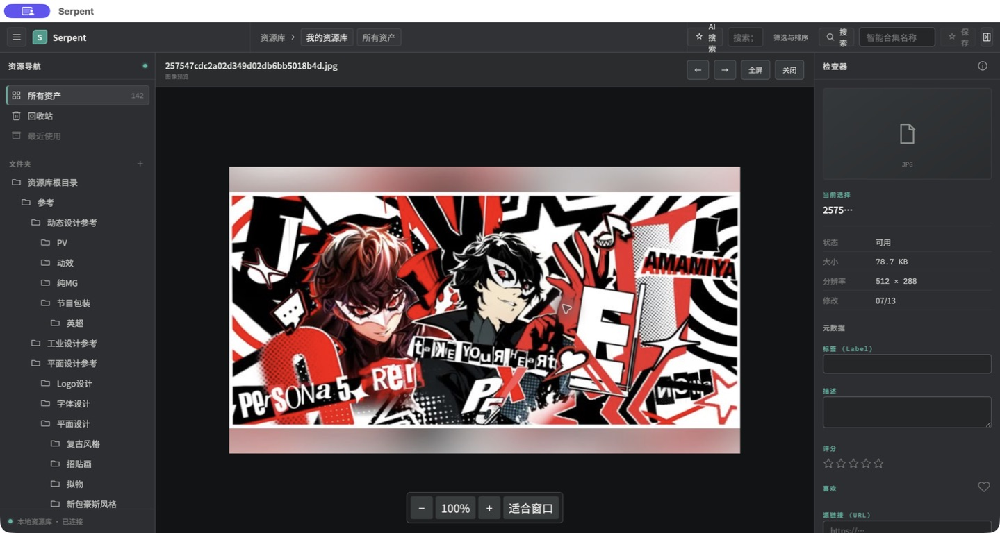
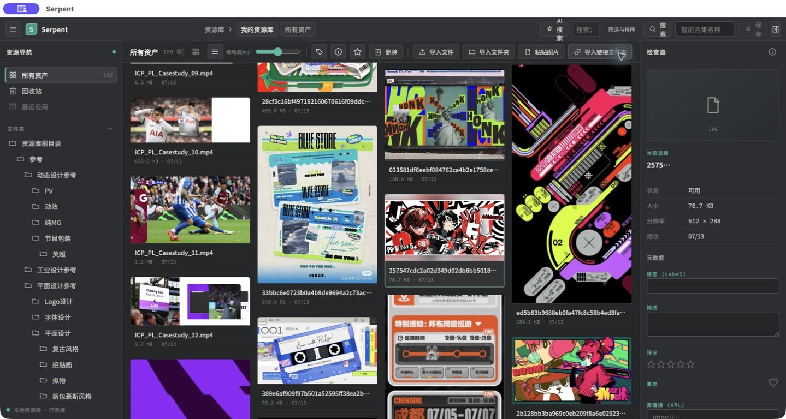

# 0013 资产查看页面导航与手势体验 QA 报告

> 日期：2026-07-14
>
> QA 范围：P0 深滚动进入查看页面错位
>
> 结论：**P0 通过，可交付人类验收；完整 0013 未通过**

## 验收结论

| 检查项 | 结果 | 证据 |
| --- | --- | --- |
| 深滚动后双击资产，查看器四边与中央画布一致 | 通过 | `asset-pagination.test.ts` 平铺/瀑布流 × 96/320 × 25%/50%/底部 12 组合，四边误差 `<= 1px` |
| 查看器不再属于滚动画布 | 通过 | `media-preview.test.ts` DOM 架构断言 |
| 关闭查看器后恢复精确滚动位置 | 通过 | E2E 等值断言 + Computer Use 截图 |
| 返回后原资产仍可见并保持选中 | 通过 | E2E viewport 断言 + Computer Use 截图 |
| 图片实际解码 | 通过 | 既有媒体 E2E `complete && naturalWidth > 0` + 真实 Electron 截图 |
| 视频回归 | 通过 | `media-video-playback.test.ts` 元数据/尺寸/播放回归 |

## 自动化记录

```text
node scripts/run-e2e.mjs \
  tests/e2e/asset-pagination.test.ts \
  tests/e2e/media-preview.test.ts \
  tests/e2e/media-video-playback.test.ts \
  tests/e2e/browsing-preferences.test.ts

6 passed
```

最终 `npm run verify:mainline` 完整通过：lint、typecheck、extension 校验、874 passed + 1 skipped、搜索性能 4/4、Electron E2E 42/42。

## 视觉证据





## 产品判断

P0 错位缺陷已达到可验收标准：用户可以在深滚动位置直接查看资产，不会因滚动偏移丢失查看内容，返回也不会跳回顶部。

截图同时显示当前查看器仍保留顶部操作区和底部缩放条；这些属于已登记的 0013 UX 缺口，不在本次位置热修范围内。因此只开放 `VIEWER-001` 人类验收，不把完整切片标记为完成。

## 保留项

- Windows 尚未执行真实平台验证。
- 完整 0013 的首次 fit、沉浸式返回语义、平移、手势灵敏度、范围切换退出和播放器体验仍不可验收。
