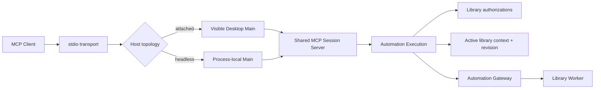

# 统一 MCP 会话与资源库上下文设计

- 状态：已接受（2026-08-09；产品确认保留现有 MCP 配置方式）
- 日期：2026-08-09
- 工单：`Serpent-a0yk`
- 依赖：[ADR-0025](../../adr/0025-automation-core-script-runtime-and-mcp.md)、[0023 自动化规格](../../implementation/0023-automation-scripting-mcp-framework.md)
- 替代范围：接受后替代 [Desktop-attached MCP 设计](2026-07-31-desktop-attached-mcp-design.md) 第 5 节的单次绑定模型和第 6 节中把 `--unbound` 视为独立模式的部分；其本机确认、无任意 DOM/路径旁路等安全约束继续有效。

## 1. 结论

Serpent 保留两种 MCP **Host 拓扑**：

- attached：连接正在运行的可见 Desktop，用户可以看到资源库切换和后续操作；
- headless：在 MCP 连接生命周期内启动隔离 Host，适合自动化测试和显式配置的本地流程。

二者不再形成两套产品能力。资源库状态统一属于 `Automation Execution`：一个执行可以 unbound，也可以拥有一个可显式切换的 Active Library Context。同一 MCP 连接可以创建、打开、切换和再次使用资源库，不需要重启 Codex、MCP 客户端或 Serpent。

安全边界不依赖“永久绑定”。Main 为每个资源库记录 Library Authorization；切换只改变当前操作上下文，不扩大权限。Desktop 焦点变化默认不会静默重定向 Agent。



## 2. 现状审视

### 2.1 必须修正的问题

| 问题 | 当前证据 | 后果 |
|---|---|---|
| Execution 把库建模为只能写一次的绑定 | `automation-execution-journal.ts` 的 `bindLibrary` 在已有 `libraryId` 时直接抛错，并注明 cannot be rebound | 同一连接不能换库，和 ADR-0025“同一 Execution 显式切换”冲突 |
| attached 在 hello 时复制首次聚焦库 | `desktop-attached-mcp.ts` 等待 active library，再把 `libraryId` 同时写入 Journal 与不可变 session | Desktop 已经换库，Agent 仍停留在旧库；想换目标只能重启 |
| 工具发现与可执行状态不一致 | `tool-catalog.ts` 只按 write access 过滤；Gateway 在 bound 状态硬编码拒绝 `library.create` | `serpent_library_create` 可见却稳定返回 `AUTOMATION_INVALID_REQUEST` |
| attached/headless 各自实现一套 MCP server | `create-serpent-mcp-server.ts` 与 `desktop-attached-mcp.ts` 都维护 `tools/list`、`tools/call`、插件拼接和结果包装 | 行为漂移；每次新增工具、通知或错误都要改两遍 |
| attached 代理只转发两个 MCP 方法 | `desktop-attached-mcp-proxy.mjs` 把 stdio MCP 降为私有 `mcp.request`，只支持 `tools/list` / `tools/call` | cancellation、progress、logging、list-changed 等标准 MCP 能力无法完整穿透 |
| 启动脚本职责重复 | `run-mcp.mjs` 和 `desktop-attached-mcp-proxy.mjs` 都解析参数/环境和启动 Electron；后者还有实际不会走到的 headless 分支 | Windows 启动修复容易只修一处；开发与 packaged 行为继续分叉 |
| `mcp-session.mjs` 再造一层私有 RPC | 它维护额外 socket、PID、日志和 `start/call/list/status/stop` 协议，只保留首个 text result | 增加生命周期与安全面，丢失 structured content 和通知；对标准 MCP 客户端没有必要 |
| 输出预算只有声明没有执行 | Registry 有 `outputLimit`，Execution 有 `maxOutputBytes`，`call-tool.ts` 却始终返回 `truncated: false` | 大结果可能突破模型上下文预算，字段对调用方具有误导性 |
| 错误被过度折叠 | MCP 统一外包成 `MCP_GATEWAY_FAILURE`；插件异常被 catch 后丢失稳定错误码 | Agent 无法判断应换库、等待、重新授权还是修正参数 |

### 2.2 已有设计中应保留的部分

- Automation Gateway 仍是唯一领域命令接缝；Renderer/MCP 不获得 Worker、SQL 或任意文件系统能力。
- MCP 输入中的 `libraryId` 不能直接成为授权依据。
- 高风险文件操作继续使用 Main 生成的计划和本机批准。
- 同一命令在开始执行后必须固定目标库；不提供跨库事务、联合搜索或跨库 Undo Group。
- attached 默认连接可见 Desktop；不会增加远程 HTTP 服务或常驻 daemon。

## 3. 统一领域模型

### 3.1 Execution 状态

```ts
type AutomationExecutionContext = {
  executionId: string;
  source: AutomationSource;
  activeLibrary: {
    libraryId: string;
    revision: number;
  } | null;
  contextFreeCapabilities: AutomationCapability[];
  libraryAuthorizations: Array<{
    libraryId: string;
    capabilities: AutomationCapability[];
    authorizedAt: string;
    authorizationSource: 'attach-confirmation' | 'context-confirmation' | 'approved-plan';
  }>;
  resourceBudget: AutomationExecutionResourceBudget;
};
```

这里的 `revision` 是 Execution 自己的上下文版本，不是资源库的 `changeSequence`：

- `context revision` 防止命令/计划在换库后落到错误资源库；
- `library changeSequence` 防止计划批准后目标库内容已经变化。

二者必须同时进入高风险计划前提。

### 3.2 三个概念必须分离

1. **Host topology**：attached 或 headless，只决定进程和可见 UI 能力。
2. **Library Authorization**：此 Execution 是否获准以某组 capability 使用某个库。
3. **Active Library Context**：下一条库级命令实际使用哪个已授权库。

`--write-access` 只表达客户端请求的最大能力，不等于任意库已经授权。切换到第一次使用的库时，Main 仍须确认；同一会话再次切回已授权库不重复弹窗。

### 3.3 不再使用“永久绑定”

Journal 用以下 Main-only API 取代一次性的 `bindLibrary`：

```ts
transitionLibraryContext({
  executionId,
  targetLibraryId,
  expectedRevision,
  authorization,
}): AutomationExecutionRecord
```

- `targetLibraryId: null` 表示回到 unbound；首个版本无需向 MCP 公共暴露主动 unbind。
- `expectedRevision` 提供 compare-and-swap，拒绝并发过期切换。
- `authorization` 是 Main 内部凭据或已存在的 Library Authorization；MCP 参数永远不能伪造它。
- 每次成功转换递增 revision，并写入执行历史。

## 4. MCP Action 面

### 4.1 新增/调整的领域命令

| MCP tool | Command | 上下文要求 | 行为 |
|---|---|---|---|
| `serpent_library_list_open` | `library.list-open` | 无 | 返回当前进程已打开库的 `libraryId`、显示名和是否为当前上下文；不返回路径 |
| `serpent_library_open` | `library.open` | 无 | 打开 Main 已知的最近库，或在 attached 中触发本机选择器；成功后授权并切换上下文 |
| `serpent_library_use` | `library.use` | 无 | 切换到已打开库；首次使用该库时本机确认，已授权则直接切换 |
| `serpent_library_create` | `library.create` | 无 | 无论当前 bound/unbound 都可执行；计划批准涵盖建库和切换，成功后新库成为当前上下文 |
| `serpent_library_inspect` | `library.inspect` | active | 返回当前上下文摘要和 `contextRevision` |
| `serpent_execution_status` | `execution.status` | 无 | 增加 active library 摘要、context revision 和已授权库数量，不暴露路径 |

`library.open` 不接受任意路径作为静默授权：

- 已知最近库通过 Main 私有目录中的稳定 `libraryId` 映射回路径；MCP 只看到 ID 和显示名；
- 任意新位置由本机文件夹选择器产生；
- headless 若要按路径启动，路径仍由宿主配置 `--library` 提供，不由普通领域命令绕过授权。

### 4.2 Registry 增加上下文元数据

删除 Gateway 对 `library.create`、`ui.notify` 的命令 ID 特判。每个 descriptor 声明：

```ts
libraryContext: 'none' | 'active' | 'transition';
hostCapabilities?: readonly ('desktop-ui')[];
```

- `none`：不要求当前库；
- `active`：Gateway 必须捕获 active library + context revision；
- `transition`：命令由 Main 执行库生命周期和上下文转换；
- Desktop-only 语义工具放在同样的声明式扩展 Registry 中，以 `desktop-ui` 能力过滤，不并入 Worker 领域命令。

### 4.3 动态工具发现

`tools/list` 同时考虑：

- MCP 来源是否允许；
- 当前 Execution 的实际 capability；
- 是否已有 Active Library Context；
- Host 是否提供 `desktop-ui`；
- 当前库是否有已激活的插件工具。

Server 声明 `tools.listChanged: true`。上下文、能力或插件工具发生变化后发送 `notifications/tools/list_changed`。调用阶段仍重复校验，不能把工具列表当授权凭据。

预期结果：unbound 会话只看到 execution、通知和库生命周期工具；切换成功后自动出现库级和该库插件工具。`library.create` 在 bound 状态继续可见且可执行。

## 5. 换库的安全与并发语义

### 5.1 显式而非跟随焦点

默认策略是 **session-pinned, explicitly switchable**：

- 用户在 Desktop 手动点到另一个库，不会静默改变 Agent 的 Active Library Context；
- Agent 调用 `library.use/open/create` 后，attached Host 同步打开或聚焦对应 Desktop 工作区，让用户看到后续操作；
- 将来可以增加用户主动开启的“跟随当前 Desktop 库”，但不属于本次修复。

这同时解决两个风险：不会串库，也不要求重启。

### 5.2 首次授权

- attached 且已有聚焦库：附着确认可直接为该库签发初始 Library Authorization。
- attached 且没有聚焦库：允许以 unbound 状态附着，确认文案明确“尚未选择资源库”；随后可 create/open/use。
- `library.use/open` 第一次进入某库：确认显示目标库名称、读/写 capability 摘要和客户端名。
- `library.create`：批准后的精确建库计划同时视为新库的授权，不再弹第二次冗余确认。
- 同一 Execution 切回已经授权且 capability 未扩大的库：不重复确认。
- capability 扩大、目标库变化或授权过期：重新确认。

### 5.3 命令目标快照

Gateway 接纳库级命令时冻结：

```ts
type CommandTargetSnapshot = {
  libraryId: string;
  contextRevision: number;
  libraryChangeSequence?: number;
};
```

上下文转换使用 execution-level exclusive barrier：

1. 停止接纳新的库级命令；
2. 等待已接纳命令完成或被取消；
3. 验证目标库已在 Worker 打开并拥有授权；
4. compare-and-swap 更新 Journal；
5. attached Host 激活目标 Desktop 工作区；
6. 发布 context-changed、library-changed 订阅重绑和 tools/list-changed；
7. 恢复命令接纳。

计划在批准前后都验证 `contextRevision + libraryChangeSequence`。任一变化返回稳定的 stale-plan/context-conflict，不得把旧批准应用到新库。

### 5.4 幂等、Undo 与通知

- 库级幂等缓存 key 改为 `executionId + libraryId + commandId + idempotencyKey`；fingerprint 同时包含 context revision。换库后复用旧 key 绝不能重放另一个库的结果。
- Undo Group 继续永久记录创建时的 libraryId；换库不会迁移或合并 Undo。
- `library.changed` 订阅在转换后只监听新的 Active Library Context。
- 新增 `automation.context.changed` 日志事件，记录旧/新 libraryId、revision 和批准来源，不记录路径。

## 6. 统一 MCP Server 与 attached transport

### 6.1 一个 Server，实现一次 tools/list 与 tools/call

引入 `SerpentMcpSessionBackend`：

```ts
interface SerpentMcpSessionBackend {
  getExecutionContext(): AutomationExecutionContext | undefined;
  getHostCapabilities(): ReadonlySet<'desktop-ui'>;
  getPluginTools(libraryId: string | null): readonly PluginMcpToolDefinition[];
  callHostTool(name: string, args: unknown): Promise<unknown>;
  subscribe(listener: (event: SerpentMcpSessionEvent) => void): () => void;
}
```

`createSerpentMcpServer` 成为唯一 MCP 协议实现。headless 与 attached 只注入不同 backend；工具生成、调用包装、错误和通知没有第二份实现。

### 6.2 Desktop control protocol v2

当前 v1 的 `hello.result` 固定返回 `libraryId`，随后只支持私有 `tools/list` / `tools/call` 请求。v2 改为：

1. proxy 连接本机 named pipe / Unix socket；
2. nonce hello 只完成客户端身份、请求能力和本机批准；响应允许 `activeLibrary: null`；
3. hello 成功后，socket 直接成为标准 MCP Transport，透传完整 JSON-RPC；
4. Desktop Main 在该 transport 上挂载共享 `createSerpentMcpServer`。

这样 cancellation、progress、logging、structured content、server notification 和未来 MCP 能力无需逐项在代理中重新发明。v1 在迁移期返回明确版本不支持，不做静默降级。

控制面仍仅本机可达，保留随机 nonce、userData 隔离和路径不外泄；Windows 使用 named pipe，macOS/Linux 使用 Unix socket。loopback TCP 只作为明确记录的兼容回退。

### 6.3 连接健壮性

- endpoint metadata 增加 `protocolVersion`、Desktop instance ID、PID 和启动时间；代理先验证进程/instance，再决定是否启动 Desktop，避免围绕过期 metadata 空转 30 秒。
- hello、每个 request 和优雅关闭都有独立超时与 AbortSignal；pending map 设置硬上限，超时后必须删除 waiter。
- proxy 与 Main 两端都执行最大 frame 限制、JSON parse 隔离和 socket backpressure；一帧损坏不能以未捕获异常结束整个代理。
- 客户端断开时向共享 Server 传播 cancellation，再终止 Execution；不能只清空 Promise 而让 Worker 命令继续悬挂。
- endpoint discovery 和 Desktop 启动采用单实例竞争检查；两个同时启动的 MCP 客户端不能各拉起一个可见 Desktop。

## 7. 启动与配置边界

### 7.1 保留现有配置方式

Serpent 继续作为普通 MCP Server 由客户端显式配置。以 Codex 为例，用户或开发者继续通过 `config.toml`、Codex 的 Add Server UI 或 `codex mcp add` 登记 `scripts/run-mcp.mjs`（发布物有等价入口时也使用同一参数契约）。本设计不要求 Serpent 自动修改 Codex 配置，也不交付第一方 Codex 插件。

配置动作是 MCP 客户端对本地工具来源的一次显式信任边界，保留它比扫描端口或静默注册更清楚。若有用户需要插件化安装体验，可由用户或社区基于公开 MCP 入口另行制作 Codex 插件，不进入 Serpent 核心范围。

内部仍可在不改变配置契约的前提下合并重复的参数解析与进程启动：`run-mcp.mjs` 负责解析、选择 topology、传播退出/信号；不修改整个 `process.env`，不自行实现 MCP 方法。`desktop-attached-mcp-proxy.mjs` 不再保留重复的 headless 启动分支。

### 7.2 参数语义

| 参数 | 新语义 |
|---|---|
| 无 `--headless` | attached topology；可在有库或无库 Desktop 上建立会话 |
| `--headless` | headless topology；Action 面不变 |
| `--library <path>` | 仅设置初始 Active Library Context；之后仍可在会话内显式换库 |
| `--unbound` | 弃用；不提供 `--library` 本来就表示初始 unbound |
| `--write-access` | 请求最大写 capability，仍需 Main/本机授权 |
| `--user-data` | 选择要附着或隔离的本机应用身份 |

现有 `config.toml` 的 command/args/cwd 配置形态保持兼容。开发态可继续依赖仓库脚本与 Forge；如果未来发布独立 `serpent-mcp` 入口，属于分发增强而非本次 P1 的完成条件。

### 7.3 `mcp-session.mjs`

标准 MCP 客户端本身已经持有长连接，推荐配置仍直接指向 `run-mcp.mjs`。`mcp-session.mjs` 作为现有可选辅助器保留，不在本次 P1 中强制删除或重写；只有当它阻断统一上下文或标准通知时才做最小兼容调整。

## 8. 错误、输出与可观察性

### 8.1 稳定错误

新增或细化：

- `AUTOMATION_LIBRARY_CONTEXT_REQUIRED`
- `AUTOMATION_LIBRARY_CONTEXT_CONFLICT`
- `AUTOMATION_LIBRARY_CONTEXT_BUSY`
- `AUTOMATION_LIBRARY_NOT_OPEN`
- `AUTOMATION_LIBRARY_AUTHORIZATION_REQUIRED`
- `AUTOMATION_LIBRARY_SWITCH_DENIED`
- `AUTOMATION_PLAN_STALE`
- `AUTOMATION_OUTPUT_LIMIT_EXCEEDED`

MCP 顶层仍可标记调用失败，但必须把 Gateway 的稳定 code 提升为机器可判断字段，不能只留下 `MCP_GATEWAY_FAILURE`。插件桥也要保留经过脱敏的稳定 code 和 `logId`。

### 8.2 输出预算

- Registry 的分页/`outputLimit` 在 Gateway 投影阶段执行；
- MCP adapter 在序列化后执行 Execution `maxOutputBytes` 硬限制；
- 超限返回可重试的分页提示或稳定错误，禁止截断 JSON；
- 删除永远为 false 的 `truncated`，或只有在确实返回合法的分页结果时设置。

### 8.3 状态与日志

`execution.status` 追加以下 path-free 字段：

- active library ID / display name；
- context revision；
- authorized library count；
- topology（诊断信息，不参与授权）；
- tools revision；
- 当前是否有 pending plan/context transition。

stderr 继续只写结构化诊断，stdout 只承载 MCP。每个请求有超时、取消和 pending 上限；Desktop 退出时所有未完成调用收到稳定 session-closed 错误。

## 9. 持久化与兼容迁移

Automation execution snapshot 从 v1 升到 v2：

- v1 `libraryId: null` → v2 `activeLibrary: null, contextRevision: 0`；
- v1 `libraryId: X` → v2 active X、revision 1，并生成 X 的现有 capability authorization；
- 保留只读兼容投影 `libraryId = activeLibrary?.libraryId ?? null`，待脚本/测试迁移后移除；
- 旧运行中 Execution 在应用重启时本就会 interrupted，不尝试恢复活跃 MCP transport。

Automation API v1 可以保持不变，因为这是新增命令和放宽原本错误的 bound `library.create`；Desktop control protocol 必须升 v2，因为 wire shape 和通知模型发生实质变化。

## 10. 实施顺序

### Phase A：契约先行

- 固化新的领域词汇、Registry `libraryContext` 元数据和错误码；
- 写 Journal context transition、Gateway 目标快照和 bound-create 的失败测试；
- 增加 v1 snapshot → v2 migration 测试。

### Phase B：可变上下文

- Journal 实现 Library Authorization + revisioned transition；
- Gateway 删除命令 ID 特判，接入 context barrier；
- 实现 `library.list-open/use/open`，让 `library.create` 在任何上下文成功并切换。

### Phase C：统一 Server

- headless/attached 共用 `createSerpentMcpServer` 和声明式 catalog；
- 插件工具按当前上下文重新解析；
- 接入 `tools/list_changed`、logging、cancellation 和输出预算。

### Phase D：attached protocol 与可见 Desktop

- Desktop control v2 直接承载 MCP transport；
- 允许 unbound attach；
- create/open/use 后激活对应 Desktop 工作区；
- 删除 attached 中平行的 tools/list/tools/call 实现。

### Phase E：启动器与文档

- 在保持现有 command/args/cwd 配置兼容的前提下合并重复参数解析和进程启动；
- 弃用把 `--unbound` 当作独立模式的语义，但保留兼容参数；
- 更新两份 MCP 手册、内部 skill 和配置示例；
- 撤销 QA 中“附着会话不跟随也不能显式换库”的旧验收措辞。

## 11. 验收矩阵

| 场景 | 必须证明 |
|---|---|
| attached + 已打开 A | 确认后 inspect A；无需重连创建 B；Desktop 可见地进入 B；继续建文件夹/导入成功 |
| attached + 无活动库 | 会话以 unbound 建立；工具列表只有上下文无关工具；create 后动态出现库级工具 |
| A/B 都已打开 | `library.use(B)` 首次确认并切换；再次 A↔B 不重启、不串库 |
| 用户手动改变 Desktop 焦点 | Agent 目标不静默改变；status 明确仍指向原库 |
| bound 状态 create | 工具可见且成功，不再返回 `AUTOMATION_INVALID_REQUEST` |
| headless 与 attached 对照 | 相同 Registry Action 的 schema、结果、错误和批准语义一致；仅 Desktop 语义工具不同 |
| 并发换库 | A 上已接纳命令只写 A；转换完成后的命令只写 B；旧计划被拒绝为 stale |
| 幂等跨库 | A 的 key 不会在 B 返回缓存结果或抑制 B 的真实命令 |
| 插件工具 | tools/list 在切库后刷新；调用只进入当前已授权库的插件实例 |
| 通知 | context changed、tools list changed、library changed 可穿过 attached transport；不含路径 |
| 生命周期 | 客户端取消、Desktop 退出、过期 endpoint、请求超时都释放 Execution 和 pending 请求 |
| 平台/分发 | Windows named pipe、macOS Unix socket、开发态和当前 HEAD packaged 均跑真实 MCP SDK Client |

最终端到端验收必须覆盖用户当前真实目标：在一个已附着且可见的 Serpent 实例中创建“meme资源库”，保持同一 MCP 连接继续创建目录、导入资产和管理合集。只有这条完整链路通过，`Serpent-a0yk` 才能关闭。

## 12. 明确不做

- 不新增公网/局域网 HTTP MCP、系统常驻 daemon 或远程无确认控制。
- 不由 Serpent 自动修改 Codex 配置，不交付第一方 Codex 插件或一键安装器；社区插件可以复用公开 MCP 入口。
- 不把 Desktop 焦点当默认 Agent 路由。
- 不允许普通领域命令用调用方提交的 `libraryId` 绕过 Execution 上下文。
- 不承诺跨库事务、跨库 Undo、联合搜索或自动复制。
- 不为了统一语义强行把 attached/headless 合并成同一个 OS 进程；统一的是领域模型与协议实现，不是部署拓扑。
