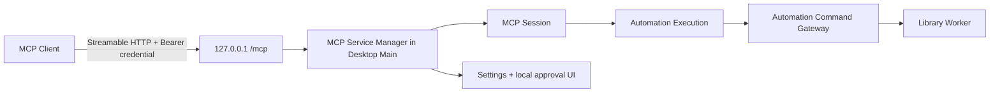

# 应用内嵌 Streamable HTTP MCP Server 顶层设计

- 状态：部分生效；仅 transport、loopback、服务生命周期与配置复制部分保留
- 日期：2026-08-10
- 工单：`Serpent-a0yk`
- 决策记录：[ADR-0029](../../adr/0029-embedded-loopback-http-mcp-server.md)
- 替代：[统一 MCP 会话与资源库上下文设计](2026-08-09-unified-mcp-session-library-context-design.md)、[Desktop-attached MCP 设计](2026-07-31-desktop-attached-mcp-design.md) 中的全部 transport、Host topology、启动与兼容方案

> 业务模型更新：本文中的 MCP session 业务上下文、资源库授权、动态工具目录、逐操作人类批准和原生选择器方案已由[业务无状态、可无人值守的 MCP 设计](2026-08-10-stateless-unattended-mcp-design.md)与[ADR-0031](../../adr/0031-stateless-unattended-mcp.md)替代。本文只继续作为 transport、服务生命周期、loopback 网络边界和配置复制的生效设计；冲突处以 ADR-0031 为准。

## 1. 产品目标

MCP 的产品目标不是让开发者从源码目录启动一个辅助进程，而是：

> 用户安装并正常打开 Serpent 后，可以在设置中启动一个受控的标准 MCP 服务；任何支持 Streamable HTTP 的 MCP 客户端只需使用复制出的连接配置即可连接，无需 Node.js、npm、源码目录、Shell 脚本、Unix socket、Windows named pipe 或 Serpent 专用代理。

目标用户包括美术、设计师和其他不具备开发环境的普通桌面用户。唯一合理的环境前提是：

1. 已安装并正在运行正式 Serpent Desktop；
2. MCP 客户端支持标准 Streamable HTTP transport；
3. 用户能把 Serpent 复制出的配置粘贴到客户端。

配置文件语法不属于 MCP 标准，各客户端可能不同。Serpent 以一个规范连接描述为源，提供若干客户端格式化输出和通用 endpoint/token 输出；不得把某个 coding agent 的配置格式写进 MCP 核心。

## 2. 顶层结论

Serpent 只保留一个 MCP 产品形态：**Desktop Main 内嵌的 loopback Streamable HTTP Server**。



明确删除以下概念和入口：

- stdio MCP Server；
- headless MCP Host；
- Desktop-attached MCP proxy；
- 私有 desktop-control JSON-RPC；
- Unix socket / Windows named pipe MCP transport；
- `run-mcp.mjs`、`desktop-attached-mcp-proxy.mjs`、`mcp-session.mjs` 等用户启动器；
- `SERPENT_MCP_*` 环境变量启动模式；
- `--headless`、`--unbound`、`--library`、`--write-access` 等 MCP 启动参数；
- 旧 endpoint metadata、旧 snapshot、旧配置和旧协议兼容迁移。

自动化测试可以在测试进程内实例化同一个 HTTP Server，但这不是第二种产品 Host。

## 3. 服务生命周期与设置体验

### 3.1 持久偏好

MCP 服务设置是设备级应用设置，位于 `userData`，不属于任何资源库：

```ts
type McpServerPreferences = {
  enabled: boolean;
  autoStart: boolean;
  port: number;
};
```

- 首次安装默认 `enabled = false`、`autoStart = false`；未经用户动作不开放端口。
- `enabled` 表示用户允许本设备运行 MCP 服务；它不是当前运行状态。
- `autoStart` 只有在 `enabled` 为 true 时可开启。它表示每次 Serpent Desktop 完成 Main、Gateway、Journal 和 Worker 初始化后自动启动服务；不表示登录系统后独立启动 daemon。
- 应用退出时服务必然退出。Serpent 不安装系统服务、登录项或后台 daemon。
- `port` 使用产品固定的高位默认值并允许在高级设置中修改。端口冲突时启动失败并显示可恢复错误；不得静默换端口使已复制的客户端配置失效。

### 3.2 运行状态机

```ts
type McpServerRuntimeState =
  | { status: 'stopped' }
  | { status: 'starting' }
  | {
      status: 'running';
      endpoint: string;
      port: number;
      connectedClientCount: number;
      activeSessionCount: number;
      startedAt: string;
    }
  | { status: 'stopping' }
  | { status: 'error'; code: McpServerErrorCode; message: string };
```

所有状态由 Main 持有并通过窄 IPC 投影给 Renderer。Renderer 不自行判断端口是否可用，也不持有 Server、credential 明文或 Automation Execution。

状态转换：

```text
stopped ──Start──> starting ──listen success──> running
   ▲                    └────failure──────────> error
   │                                                  │
   └──────────────Stop complete<──stopping<──Stop─────┘
```

- “启动”先持久化 `enabled = true`，再尝试监听。
- 关闭“允许 MCP 服务”会停止 listener、关闭 session，并同时关闭 `autoStart`，避免以后意外重新开放端口；单独点击“停止服务”不改变 `autoStart`，因此下次启动 Serpent 时仍可按用户偏好自动运行。
- “停止”先停止接纳新连接，再关闭所有 MCP session；已提交给 Worker、无法安全回滚的文件任务按既有 Job 恢复语义完成或对账，不能靠杀进程制造半写入。
- 关闭服务后所有连接收到稳定的 session-closed 结果或 transport 关闭；对应 Automation Execution 终止并释放预算、订阅和授权。
- 修改端口时若正在运行，UI 明确提示需要重启服务，并在一次 Main 控制操作中 stop → bind new port；失败则保持 stopped/error，不回退旧端口造成状态歧义。

### 3.3 设置页面

应用设置增加一级分类“自动化”，其中 MCP 卡片至少提供：

- 允许 MCP 服务开关；
- 当前状态：已停止、正在启动、运行中、正在停止、启动失败；
- “启动服务”/“停止服务”按钮；
- “启动 Serpent 时自动启动 MCP 服务”开关；
- 当前 endpoint 与端口；
- “复制给 Agent”主按钮；
- 配置格式菜单：已支持客户端格式、通用 JSON、仅复制 endpoint 和 credential；
- 当前连接数、活动 session 数；
- 已签发客户端 credential 列表及逐项撤销；
- 按客户端管理普通权限的入口、权限矩阵和“开启所有权限”操作；具体作用域与 critical 例外见 ADR-0030；
- 打开诊断日志入口。

“复制给 Agent”仅在服务已启用且端口配置有效时可用。创建新客户端配置会生成新的 credential；对已有 credential 执行复制会重新输出同一 credential 的固定 token，不新增副本，也不会让已经连接的 Agent 失效。复制内容含秘密，UI 必须明确提示不要分享。Server 使用 token hash 做认证，并在当前用户保护的凭据文件中加密保存 token，以便用户再次复制；明文只在 Main 进程生成连接文本并写入剪贴板时出现。

## 4. Transport 与网络边界

### 4.1 唯一 transport

- 使用 MCP SDK 的 Streamable HTTP Server transport；同一个 `/mcp` endpoint 支持规范要求的 POST、GET 和 DELETE。
- 每个 MCP initialize 建立独立 session 与 Automation Execution；不同客户端和不同连接不得共享上下文、授权、取消状态或幂等缓存。
- initialize/授权超时、客户端断开和长期无活动的 session 必须自动回收，并结束对应 Automation Execution，不能依赖重启服务清理。
- Server 声明并实现 `tools.listChanged`、logging、cancellation、progress 和 session termination；不得再通过私有协议挑选性转发 MCP 方法。
- 单个 MCP 协议实现负责 tools/list、tools/call、资源、通知、错误包装和输出预算；设置 IPC 只管理 Server 生命周期，不复制 MCP 逻辑。

### 4.2 loopback-only

- 只绑定字面地址 `127.0.0.1`，不绑定 `0.0.0.0`、局域网网卡、IPv6 wildcard 或主机名 `localhost`。
- 校验 `Host`/authority 必须指向允许的 loopback endpoint；拒绝伪造 Host。
- 缺少 `Origin` 的非浏览器 MCP 请求可以继续验证；存在 `Origin` 时只接受明确的 loopback allowlist，其他 Origin 一律拒绝，防止 DNS rebinding。
- 不启用 CORS，不提供浏览器可读取的匿名健康检查，不在未认证响应中泄露 Serpent 版本、资源库、工具或客户端信息。
- 认证在 JSON body 解析之前完成；设置请求体、header、并发连接、session、pending request、输出字节和请求时间硬上限。
- 日志不得记录 Authorization header、完整 token、MCP 输入中的秘密字段、任意磁盘路径或未脱敏结果。

本设计不支持局域网或公网远程控制。未来若需要远程访问，必须单独设计 HTTPS、标准 OAuth、用户/设备身份、证书、网络暴露、速率限制和远程撤销；不得把本地监听地址改成 `0.0.0.0` 作为“远程模式”。

### 4.3 端口与单实例

- Electron 的 single-instance lock 决定唯一 Desktop Main；只有主实例可以持有端口。
- macOS 和 Windows 使用同一 Node HTTP listen 语义，不再维护平台专用 transport。
- 端口被占用、权限拒绝、Server 异常和异常退出都映射为稳定错误码，并在设置页可见。
- 自动启动失败不阻止 Serpent 正常打开和使用资源库。

## 5. 客户端身份与权限模型

权限分五层，任何一层都不能由下一层反向推导：

| 层 | 决定什么 | 证据来源 |
|---|---|---|
| Server enabled | 本机是否开放 MCP listener | 用户设置 |
| Client credential | 请求是否来自已配置客户端 | 高熵 Bearer token 的 hash 校验 |
| Permission policy / session grant | 当前客户端或当前连接是否可使用某项普通能力 | 设置中的按客户端策略或调用时本机授权 |
| Library Authorization | 当前 session 是否获准访问某个资源库 | 本机确认或已批准的精确建库计划 |
| Operation approval | 某次高风险写入是否获准执行 | 绑定参数、库和版本的 Execution Plan |

### 5.1 Client credential

```ts
type McpClientCredentialRecord = {
  credentialId: string;
  tokenHash: string;
  tokenCiphertext: string;
  label: string;
  createdAt: string;
  lastUsedAt: string | null;
  revokedAt: string | null;
};
```

- token 至少 256 bit，使用 CSPRNG；通过 `Authorization: Bearer <token>` 发送。
- 磁盘保存带应用级 pepper 的安全 hash，并保存用同一受保护 pepper 加密的 token，以便用户重复复制固定客户端授权；不保存可直接读取的明文。
- `initialize.clientInfo` 用于显示和审计，不能代替 credential 身份。
- 撤销 credential 后立即拒绝新请求，并关闭该 credential 的现有 session。
- credential 不携带资源库路径、libraryId 或永久写权限。

首版不在本地 HTTP 上实现半套 OAuth，也不为 loopback 安装自签名根证书。Bearer credential 是明确的本地配对能力；若未来引入远程服务，则整体升级为符合 MCP 授权规范的 OAuth 资源服务器，而不是扩张本地 token 的适用范围。

### 5.2 权限策略与会话授权

每个成功 initialize 创建新的 Automation Execution。Execution 初始不拥有资源库上下文；安全读取能力默认可用，受控能力由 Permission Broker 根据当前客户端的持久策略、当前 Execution 的 session grant 或本次用户决定解析。工具输入不能请求或扩大权限，读、普通元数据写、文件生命周期写和 Desktop UI 控制分别建模，不用单一 `writeAccess` 或 `skipApproval` 布尔值。

Session 结束时会话授权与 Library Authorization 一并失效。按客户端的持久 Permission Policy 可以跨 session 保留，但不授予资源库访问，也不覆盖 critical 操作。完整解析顺序、撤销语义和确认 UI 见 ADR-0030。

## 6. 资源库上下文

“没有当前资源库”是 Automation Execution 的一种上下文状态，不再称为 headless。产品中没有 attached/headless 两种 Host。

```ts
type AutomationExecutionContext = {
  executionId: string;
  clientCredentialId: string;
  activeLibrary: { libraryId: string; revision: number } | null;
  libraryAuthorizations: LibraryAuthorization[];
  capabilities: AutomationCapability[];
  resourceBudget: AutomationExecutionResourceBudget;
};
```

保留以下语义：

- 同一连接可以 `library.create`、`library.open`、`library.use` 并继续工作，不需要重连。
- `library.list-open` 只返回 ID、显示名和 active 状态，不返回路径。
- `library.open` 不接受调用方提供的任意磁盘路径；未知路径必须通过可见 Desktop 文件夹选择器产生。
- 首次使用某库时显示库名、客户端和 capability 摘要，由用户确认；同一 session 切回已经授权且能力未扩大的库不重复确认。
- MCP 请求原生选择器或高风险计划前，Desktop 先显示不含绝对路径的 info 上下文提示；`ui.notify` 作为受限只读工具对只读 session 可见。
- 用户手动切换 Desktop 资源库不会静默改变 Agent 目标；Agent 显式换库成功后 Desktop 可见地切到目标库。
- context revision、library changeSequence、exclusive transition barrier、跨库幂等 key、stale plan 和动态 tools/list 继续按被替代设计的领域语义执行。
- 所有 MCP Action 仍只能通过 Automation Command Gateway；不能访问任意 SQL、Shell、Node、网络或文件系统。

## 7. 模块边界

建议实现边界如下；具体文件名可调整，但职责不得重新合并进 `main/index.ts` 或 `App.tsx`：

```text
src/main/mcp/
├─ mcp-service-manager.ts       # start/stop/auto-start/state machine
├─ mcp-http-server.ts           # HTTP routing, limits, Origin/Host/auth
├─ mcp-session-manager.ts       # transport/session/Execution lifecycle
├─ mcp-client-credentials.ts    # issue/hash/encrypt/list/revoke credentials
├─ mcp-settings-store.ts        # device-level validated preferences
└─ mcp-settings-ipc.ts          # narrow Renderer contract

src/mcp/
├─ create-serpent-mcp-server.ts # only MCP protocol implementation
├─ call-tool.ts                 # Gateway adapter and output budget
└─ tool-catalog.ts              # context/capability/plugin-driven catalog

src/renderer/settings/
└─ McpSettingsPage.tsx          # presentational settings surface
```

依赖方向：

```text
Renderer settings
  -> typed preload API
  -> Main MCP Service Manager
  -> MCP Session Manager
  -> Automation Execution Journal
  -> Automation Command Gateway
  -> Library Worker
```

Main 是 listener、credential、Automation Execution 和本机批准的唯一所有者。Renderer 只收到脱敏状态；Library Worker 不知道 HTTP、token 或 MCP session。

## 8. IPC 与配置复制契约

Renderer 仅获得以下语义 API：

```ts
interface SerpentMcpSettingsApi {
  getState(): Promise<McpSettingsSnapshot>;
  setAutoStart(enabled: boolean): Promise<McpSettingsSnapshot>;
  setPort(port: number): Promise<McpSettingsSnapshot>;
  start(): Promise<McpSettingsSnapshot>;
  stop(): Promise<McpSettingsSnapshot>;
  createClientConfig(input: {
    format: McpConfigFormat;
    label?: string;
  }): Promise<{ copied: true; credentialId: string }>;
  revokeCredential(credentialId: string): Promise<McpSettingsSnapshot>;
  subscribe(listener: (snapshot: McpSettingsSnapshot) => void): () => void;
}
```

- 所有 request/response/event 经 Zod 校验。
- `createClientConfig` 在 Main 生成 token、按选定格式渲染并直接写系统剪贴板；明文不经过 Renderer。
- 规范连接描述仅含 `transport = streamable-http`、endpoint 和 Authorization header。客户端格式化器是纯函数并单测；未知客户端使用通用输出。
- 配置中不出现 `command`、`args`、`cwd`、Node 路径、源码路径或环境变量。

## 9. 动态工具与错误

`tools/list` 由 Registry、session capability、Active Library Context、Library Authorization、Desktop host capability 和当前库插件共同生成。上下文或插件变化后发送 `notifications/tools/list_changed`；调用阶段再次校验全部权限。

稳定错误至少包括：

- `MCP_SERVER_DISABLED`
- `MCP_SERVER_ALREADY_RUNNING`
- `MCP_SERVER_PORT_UNAVAILABLE`
- `MCP_CLIENT_UNAUTHORIZED`
- `MCP_CLIENT_REVOKED`
- `MCP_SESSION_NOT_FOUND`
- `MCP_SESSION_CLOSED`
- `AUTOMATION_LIBRARY_CONTEXT_REQUIRED`
- `AUTOMATION_LIBRARY_CONTEXT_CONFLICT`
- `AUTOMATION_LIBRARY_CONTEXT_BUSY`
- `AUTOMATION_LIBRARY_AUTHORIZATION_REQUIRED`
- `AUTOMATION_LIBRARY_SWITCH_DENIED`
- `AUTOMATION_PLAN_STALE`
- `AUTOMATION_OUTPUT_LIMIT_EXCEEDED`

Gateway 稳定错误必须提升到 MCP structured content，不能全部折叠成 `MCP_GATEWAY_FAILURE`。超出输出预算时返回分页指引或完整错误，禁止截断 JSON，也不返回永远为 false 的 `truncated`。

## 10. 无兼容负担的删除策略

本产品尚未发布稳定 MCP 接口，因此本次采用直接替换：

- 不提供双栈期；HTTP 合入时同步删除 stdio/socket/proxy 入口和测试。
- 不读取、迁移或回写旧 MCP endpoint/session/snapshot 配置；开发机旧文件按未知旧格式隔离并重新生成。
- 不保留旧错误、启动参数、环境变量或工具暴露行为的兼容分支。
- 不保留仅供旧测试使用的 production API；测试迁移到真实 Streamable HTTP client。
- 文档、内置 skill、示例配置和 QA 清单在同一变更中更新，仓库中不得继续推荐 npm/stdio 启动。

领域层已经存在且仍正确的 Gateway、Registry、Execution Plan、Journal 和 Library Worker 不因 transport 重做；只删除为旧 transport/Host topology 服务的分叉。

## 11. 实施顺序

### Phase A：删除旧概念并固化契约

- 更新 ADR、领域词汇、Registry context 元数据和设置 IPC schema；
- 删除产品入口中的 stdio/headless/attached/socket 分支；
- 为 Server preferences、runtime state、credential record 和配置输出写契约测试。

### Phase B：HTTP 与 credential 基础

- 实现 settings store、credential store、Service Manager；
- 实现 loopback HTTP、Host/Origin/auth/body/session/request 限制；
- 用官方 MCP SDK Client 验证 initialize、tools/list、tools/call、GET stream 和 DELETE session。

### Phase C：Execution 与资源库上下文

- 每个 HTTP session 创建/终止 Automation Execution；
- 完成可变 Active Library Context、Library Authorization、context barrier；
- 完成 create/open/use、动态工具和稳定错误。

### Phase D：设置 UI

- 新增“自动化”设置页及运行状态、启停、自动启动、端口和 Agent 连接信息复制；
- 新增 credential 列表与撤销；
- 本机批准对话框显示 credential label、MCP clientInfo、目标库和 capability。

### Phase E：删除、文档与验收

- 删除所有旧 transport 文件、脚本、环境分支、手册和测试 fixture；
- 更新 MCP 用户手册为“安装 Serpent → 设置中启动 → 复制 Agent 连接信息 → 粘贴连接”；
- 跑完整门禁、真实 packaged 应用和独立代码审查。

## 12. 验收矩阵

| 需求 | 自动化证据 | 人工/平台证据 |
|---|---|---|
| 默认不监听 | 新 userData 启动后端口不可连接 | macOS/Windows packaged 设置页显示已停止 |
| 手动启停 | start 后 SDK Client 可 initialize；stop 后连接关闭且端口释放 | 设置状态和按钮无卡死、错误可恢复 |
| 自动启动 | 开启后完整退出并重启，Server 在 Main 就绪后监听 | packaged 重启验证，不复用旧进程 |
| 复制 Agent 连接信息 | Main 生成或复用固定 credential，输出无 command/cwd/npm 且包含 Bearer 授权与使用提示；SDK Client 使用配置连接 | 粘贴到至少一个真实支持 HTTP 的 MCP 客户端，并重复复制确认原 token 仍有效 |
| credential 隔离 | A/B token 独立；撤销 A 不影响 B；错误 token 在解析 body 前 401 | 已授权客户端列表与连接数正确 |
| loopback 安全 | 只监听 127.0.0.1；恶意 Host/Origin、超大 body、过量 session 被拒绝 | Windows 无需开放公网防火墙规则 |
| 无库连接 | initialize 成功，只列上下文无关工具 | 可见 Desktop 无资源库时可连接 |
| 同连接建库换库 | create B 后工具刷新；A↔B 不重连、不串库 | Desktop 可见地切换，批准文案准确 |
| 并发与计划 | 换库 barrier、stale plan、跨库幂等均有确定测试 | 长任务期间停止服务行为清楚 |
| 动态插件工具 | 换库/启停插件后 tools/list_changed 且仅调用当前库实例 | 插件设置与 MCP 工具一致 |
| 协议完整性 | initialize、list、call、cancel、progress、logging、GET、DELETE | 真实第三方 MCP 客户端连接 |
| 平台 | Node 单元/集成 + Electron E2E | 当前 HEAD macOS packaged；Windows packaged/installer 实机或 runner，未跑不得写通过 |

最终端到端旅程：安装并启动 Serpent，在设置中手动启动 MCP，复制 Agent 连接信息到标准 HTTP MCP 客户端；保持同一连接创建“示例资源库”，继续创建目录、导入资产、管理合集，然后停止服务并确认连接和端口释放。只有完整旅程通过才能关闭 `Serpent-a0yk`。

## 13. 明确不做

- stdio、headless、attached、私有 socket、CLI 或 Node/npm 启动器；
- Serpent 关闭后继续工作的 daemon；
- 局域网、公网、云端 MCP 或 `0.0.0.0`；
- 为不支持 Streamable HTTP 的旧 MCP 客户端提供桥接兼容；
- 自动扫描或修改第三方客户端配置；
- 让 token、端口或 clientInfo 自行产生资源库权限；
- 普通 MCP 参数携带任意绝对路径、SQL、Shell、Node、网络或秘密配置；
- 跨资源库事务、跨库 Undo 或联合搜索。
