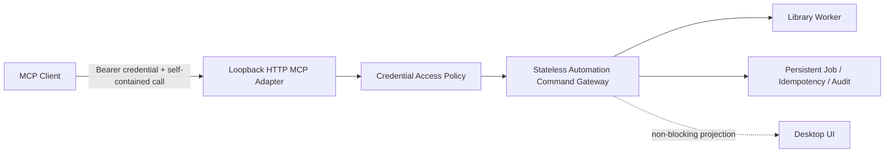

# 业务无状态、可无人值守的 MCP 设计

- 状态：已接受
- 日期：2026-08-10
- 工单：`Serpent-8b5b`
- 决策记录：[ADR-0031](../../adr/0031-stateless-unattended-mcp.md)
- 替代：[应用内嵌 Streamable HTTP MCP Server 顶层设计](2026-08-10-embedded-http-mcp-server-design.md)中的 session 业务上下文、资源库授权和动态工具目录，以及[细粒度权限与关键危险操作确认设计](2026-08-10-mcp-permission-policy-and-critical-confirmation-design.md)中的会话授权、逐操作确认和 critical 强制人工确认

## 1. 问题与产品目标

现有实现把以下内容放进 MCP transport session：

- 当前资源库；
- 已确认的资源库授权；
- 会话级 capability grant；
- 随上下文变化的工具目录；
- 等待原生文件选择器或本机确认的执行状态。

这使协议层的正常行为变成产品故障：客户端重连、刷新工具、并行连接或恢复网络后会丢失业务上下文，重复请求切换资源库和权限；工具可能突然消失；导入还会弹出没有充分上下文的系统选择器。一次批量整理任务因此需要用户确认几十次，无法由 Agent 无人值守完成。

MCP 的目标重新定义为：

> 用户只需安装并启动 Serpent、复制一次客户端配置；此后 Agent 的每个请求都完整描述目标和意图。网络重连、协议 session 和 Desktop 焦点都不改变请求语义。默认 Auto 模式下，普通操作直接执行，真正危险的操作由 MCP 返回风险报告并要求 Agent 进行第二次协议确认；全程零权限弹窗、零选择器、零人工参与。

核心原则：**Configure once, authenticate automatically, every call self-contained.**

可用性是这一接口成立的前提。安全能力必须通过静态边界、显式参数、幂等、校验、恢复、审计和即时撤销实现，不能依靠高频打断用户。

## 2. “无状态”的准确含义

Serpent MCP 是**业务无状态**的：一次工具调用的业务结果只由已持久化的产品状态、客户端凭据策略和本次完整输入决定，不依赖调用前是否执行过 `library.use`、当前连接建立了多久、客户端是否刷新过 `tools/list`，也不依赖 Desktop 当前显示哪个资源库。

MCP SDK 的 transport session 可以保留，但它只能承载协议机制：

- request correlation；
- progress、logging 和 cancellation；
- SSE/HTTP 连接生命周期；
- 单个在途请求的资源预算。

transport session **不得**承载：

- active library；
- library authorization；
- capability grant；
- 动态工具可见性；
- 跨请求的默认目标；
- 操作批准或幂等结果。

幂等结果、后台 Job 和审计必须存放在独立于 transport session 的持久层中，并以 `credentialId + idempotencyKey` 或 Job ID 寻址。客户端断开不会取消已经安全提交的 Job；显式 cancel 才按命令的取消语义处理。

## 3. 顶层架构

保留 Desktop Main 内嵌、仅监听 `127.0.0.1` 的 Streamable HTTP MCP Server。废止 session-bound business context。



边界如下：

- credential 识别调用者并提供持久权限策略；
- 每个工具输入显式提供目标资源库、实体和操作参数；
- Gateway 继续实施 Schema、实体版本、资源库 `changeSequence`、冲突、文件安全和 Worker 所有权；
- Desktop UI 是业务状态的投影，不是 Agent 命令的前置条件；
- 本机提示用于可观察性，不能阻塞 Agent 调用。

## 4. 静态工具目录与显式目标

### 4.1 工具目录

核心 `tools/list` 对所有已认证客户端保持静态；它不因资源库是否打开、Desktop 焦点、历史调用或访问模式而隐藏工具。插件增删工具仍可触发 `tools/list_changed`，但这属于产品扩展变化，不是 session 上下文变化。

调用不满足前置条件时返回稳定、可行动的结构化错误，例如 `LIBRARY_NOT_FOUND`、`LIBRARY_NOT_OPEN`、`ENTITY_VERSION_CONFLICT`；不能通过隐藏工具表达前置条件。

### 4.2 资源库目标

所有库级命令必须携带：

```ts
type ExplicitLibraryTarget = {
  libraryId: string;
};
```

不提供隐式 session active library。读取 `library.list-open` 或创建/打开资源库后，Agent 从结果中获得 `libraryId`，后续每个请求都回传它。每个响应也回显：

```ts
type LibraryScopedResult<T> = {
  libraryId: string;
  libraryChangeSequence: number;
  result: T;
};
```

“Desktop 当前资源库”只是一项 UI 状态。`library.show-in-desktop({ libraryId })` 可以显式要求 Desktop 显示某库：

- 已经显示该库时是无副作用成功；
- 不建立 MCP 默认目标；
- 不授予权限；
- 不影响其他连接后续命令；
- 不允许因为重连、initialize 或 `tools/list` 自动触发。

旧 `library.use` 不再承担“绑定当前 session”语义，应删除或重命名为明确的 UI 命令，产品未发布，不保留兼容层。

### 4.3 多客户端和并发

不同客户端可同时操作不同资源库。Desktop 焦点切换不改变任何在途或后续 MCP 请求。并发冲突由显式 `libraryId`、实体版本、`changeSequence`、幂等键和 Worker 串行化/事务规则处理，不能用全局“当前库”消除歧义。

## 5. 默认 Auto 权限与 Agent 二阶段确认

权限策略绑定 credential 并持久化，绝不绑定 transport session。它只决定某类能力能否调用，不在命令执行时询问人类。

```ts
type McpClientPermissionMode = 'auto' | 'full-access';

type McpClientPolicy = {
  credentialId: string;
  mode: McpClientPermissionMode;
  updatedAt: string;
};
```

### 5.1 权限模式

- `auto` 是新配置的默认值：允许普通读写和可恢复操作；危险操作进入 Agent 二阶段确认。
- `full-access` 由设置页独立的红色危险提示开启；开启后所有已暴露 MCP 操作直接执行，包括跳过危险操作的 Agent 二阶段确认。

不提供 `ask`、`allow-once`、`allow-session` 或运行中人类权限提示。用户不会认真逐个审批数十个重复弹窗；这种交互最终只会迫使用户盲目选择全部允许，并不能提供真实安全性。用户若不信任客户端，应提前限制能力、禁用客户端、撤销 credential 或停止 MCP Server。

### 5.2 风险分级

每个命令在 Registry 中声明风险，而不是由 UI 临时猜测：

| 风险 | 示例 | Auto 行为 |
|---|---|---|
| `routine` | 查询、创建文件夹、写标签、导入、生成预览 | 直接执行 |
| `recoverable` | 移入 Serpent 回收站、可撤销批量整理 | 直接执行，返回恢复/Undo 信息 |
| `dangerous` | 从磁盘永久删除、删除整个资源库、覆盖不可恢复外部文件 | 首次只返回风险报告；Agent 二次确认后执行 |

只有不可恢复、低频或可能造成大范围数据损失的操作属于 `dangerous`。不能把导入、切库、创建合集、写元数据等正常工作包装成 dangerous 来逃避产品设计。

工具使用 MCP 标准 annotation 标明 `readOnlyHint`、`destructiveHint`、`idempotentHint`；描述中明确写出危险性质。标准元数据用于客户端展示，但 Serpent 的二阶段执行规则不依赖客户端是否展示它。

### 5.3 危险操作的 Agent 二阶段确认

危险工具第一次调用永远不修改状态，而是返回：

```ts
type DangerousOperationChallenge = {
  status: 'confirmation-required';
  challengeId: string;
  operation: string;
  severity: 'dangerous';
  summary: string;
  irreversibleEffects: string[];
  affectedTargets: Array<{ id: string; displayName: string }>;
  affectedCount: number;
  recovery: 'none' | 'partial';
  planHash: string;
  expiresAt: string;
};
```

MCP 必须用面向 Agent 的清晰语言说明：危险在哪里、哪些对象会受影响、是否可恢复、影响数量和前置版本。Agent 评估风险后，以同一工具进行第二次调用：

```ts
type DangerousOperationConfirmation = {
  challengeId: string;
  planHash: string;
  acknowledged: true;
  idempotencyKey: string;
};
```

challenge 绑定 `credentialId + command + 完整规范化参数 + 目标 ID + libraryId + 前置版本/changeSequence`，短时有效且只能成功消费一次。单独的 `acknowledged: true`、自然语言“确认”或复用其他操作的 challenge 都无效。第二次调用前若任何前提变化，Serpent 不执行并返回新的风险报告，由 Agent 重新判断。

这个流程的目的不是阻止恶意客户端——credential 和能力禁用负责信任边界——而是让正常 Agent 无法在一次含糊或误构造的调用中直接完成不可恢复写入。Agent 可以自主完成两次调用，不需要人类接管。

### 5.4 非交互式防护

零弹窗不等于绕过领域安全：

- destructive 命令要求显式目标 ID，禁止通配符和隐式“当前对象”；
- 文件删除优先进入可恢复回收站；永久删除严格限定在明确目标和 Serpent 管理边界内；
- 路径在 Main/Worker 规范化并校验，拒绝空路径、资源库根目录逃逸、设备根目录和不允许的符号链接穿越；
- 有版本/计划前提的命令在执行瞬间重新校验；过期即返回错误或新 challenge，不弹窗；
- 每个 credential 有并发、请求体、Job 和输出预算；
- 所有写入记录脱敏审计，设置页可以即时停止服务或撤销 credential；
- 可恢复任务遵守 crash recovery 和磁盘/数据库对账，不依赖 HTTP 连接存活。

## 6. 文件和路径操作

常规 Agent 工作流必须接受显式路径，不能强制原生选择器：

```ts
type ImportFilesInput = {
  libraryId: string;
  sources: Array<{ absolutePath: string }>;
  targetFolderId?: string;
  conflictPolicy: 'skip' | 'rename' | 'replace';
  idempotencyKey: string;
};

type CreateLibraryInput = {
  displayName: string;
  parentDirectoryPath: string;
  idempotencyKey: string;
};
```

路径是本机 Agent 已知输入，不经 Renderer。Main/Worker 执行跨平台规范化、存在性、类型、权限和边界检查。错误返回到 MCP 客户端，包含稳定错误码和可修复字段；不得弹系统对话框。

MCP 不提供会打开系统文件选择器的工具。需要人工浏览磁盘时，用户直接使用 Serpent Desktop 的导入和建库界面；Agent API 始终使用显式路径，避免同一工具在不同模式下出现完全不同的阻塞行为。

Windows 必须专门覆盖盘符、UNC、长路径、大小写不敏感、保留名、反斜杠、junction/reparse point 和原子文件替换；macOS 结果不能推断 Windows 已通过。

## 7. Desktop 同步与信息提示

Desktop 模式表示用户可以看见 Agent 的工作结果，不表示 Agent 必须通过 UI 完成工作。

- Agent 创建、打开或显式 `show-in-desktop` 资源库后，Renderer 通过 Main 事件同步可见状态；
- 同一 revision 的重复事件幂等，不重复弹切库请求；
- 批量导入、后台预览和 AI 分析显示非阻塞进度；
- Host 自动为会打开交互 UI 的命令显示说明，不依赖 Agent 先调用 `ui.notify`；
- `ui.notify` 始终可用，但只显示非阻塞 info/progress/success/warning，不承担批准；
- 通知合并同一 operation/job 的更新，避免刷屏。

## 8. 长任务、重连与取消

可能超过短 HTTP 超时的操作应快速返回持久 Job：

```ts
type AcceptedJob = {
  jobId: string;
  libraryId?: string;
  status: 'queued' | 'running';
};
```

客户端可通过静态 `job.get`、`job.list`、`job.cancel` 查询或控制。progress 通知是优化，不是正确性的唯一来源。重连后用 Job ID 继续查询，不需要恢复原 session。服务或应用重启后，可恢复 Job 由现有 Worker 恢复机制对账。

## 9. 设置与首次连接体验

设置页首先面向不理解端口、Bearer、session 或 JSON 的美术和设计师。主流程只有：

1. 开启 MCP 服务；
2. 点击“复制到 Cursor / Claude / Codex / 通用客户端”；
3. 在目标客户端粘贴一次。

复制结果必须是完整可用的单个配置块，自动包含稳定 endpoint 和 credential；用户不编辑 token、URL、header、路径或命令，不安装 Node.js，不运行 npm，不打开终端。credential 跨 Serpent 和 MCP Server 重启稳定，只有用户主动撤销时失效。目标客户端若支持安装链接或系统集成，可进一步提供“一键添加”，但不能把它作为唯一入口。

新 credential 默认 `auto`。设置页把技术细节收进高级区域，主区只展示客户端名称、启用状态、权限模式、撤销和最近活动；还提供紧急“停止 MCP 服务”。

不再展示 session grant、资源库授权、当前 session、动态 capability 状态、“本会话总是通过”或逐操作审批历史。连接数可以作为诊断信息，但不能影响权限语义。

首用验收从“用户打开 Serpent 设置”开始计时：不借助手册和终端，60 秒内完成配置并由客户端成功调用 `library.list-open`；Serpent 重启和客户端重连后无需重新配置。

## 10. 错误契约

所有错误直接返回 Agent，禁止用用户弹窗作为错误通道。至少包含：

```ts
type McpDomainError = {
  code: string;
  message: string;
  retryable: boolean;
  libraryId?: string;
  field?: string;
  currentVersion?: number;
  jobId?: string;
};
```

认证失败、凭据禁用、模式不允许、路径无效、资源库未打开、版本冲突、任务繁忙和预算超限使用稳定不同错误码。错误不得泄露 token；路径错误可以向已认证调用者返回其自己提交的规范化目标，不向未认证请求泄露磁盘信息。

## 11. 被废止的设计

以下概念从 MCP 产品模型中删除，不做兼容：

- session active library；
- session library authorization；
- session capability grant；
- `library.use` 绑定后续命令；
- 按 session 上下文动态隐藏工具；
- initialize 时资源库或写权限批准；
- 每次切换/重连重新确认资源库；
- 运行中的任何人类权限/计划/critical 确认；
- 将 `acknowledged: true` 单独作为危险操作保护，而不绑定精确 challenge；
- 常规导入和建库强制原生选择器；
- 为刷新工具而新建业务 session；
- 把 Desktop 当前焦点当作 Agent 隐式目标。

产品尚未发布，不提供旧协议迁移或兼容 shim。旧字段和旧工具应在同一版本直接删除，以免两套语义并存。

## 12. 实施切片与验收

1. **契约与领域模型**：建立显式 `libraryId`、静态工具目录、稳定错误和 stateless dispatcher；删除 session business context。
2. **凭据权限与危险握手**：实现默认 `auto`、`read-only/custom` 静态限制和危险操作 Agent 二阶段 challenge；删除运行时人类 Prompt。
3. **自主路径操作**：为导入、建库及相关文件操作增加显式路径契约；Agent 路径零选择器。
4. **Job 与 UI 投影**：长任务持久化、重连查询、幂等取消；Desktop 事件同步和非阻塞通知。
5. **清理旧框架**：删除 session grant、library authorization、动态目录、旧 Broker/prompt/critical MCP 分支和兼容代码。
6. **自动化与平台证据**：标准 MCP SDK 多连接/重连测试、Renderer/Electron E2E、当前 HEAD packaged；Windows 独立验证。
7. **文档对齐**：用户手册、API reference、开发文档、automation skill、类型声明、QA 四列追溯与旧术语清理。

关键验收旅程：默认 Auto credential 连续断开重连三次并并行使用两个 transport session，仍可在明确 `libraryId` 下创建文件夹、从显式路径导入 700+ 图片、整理合集、写作者元数据、查询 Job 和让 Desktop 显示结果；全过程用户点击数为 **0**，权限弹窗数为 **0**，系统选择器数为 **0**，重复切库请求数为 **0**。另以临时资源库验证危险操作第一次调用绝不写入、风险报告完整，第二次调用只有精确 challenge 有效，过期/篡改/重放均不执行。
