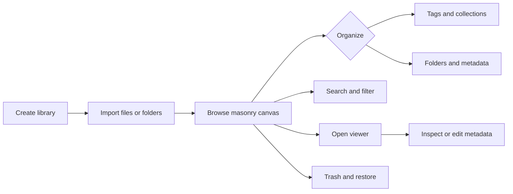

# User Guide

A Serpent usage guide for end users. Chinese version: [README.md](README.md)

- [Install](installation.en.md) — macOS / Windows, browser extension, upgrades
- [Basics](basics.en.md) — create a library, import, browse, search, tags, collections, 3D viewer
- [Plugins, scripts and MCP](extensions.en.md) — using extensions
- [Troubleshooting](troubleshooting.en.md) — common problems and fixes

## Quick start

1. Install Serpent (see [Install](installation.en.md))
2. Launch the app and create a local library
3. Drag images, videos or 3D models into the window, or click Import
4. Assets appear in the grid. Double-click to view or play; right-click for more actions

All data stays in your local library directory — no cloud sync.

## Interface at a glance

A typical workspace has library navigation on the left, the masonry canvas in the center, and the Inspector on the right. Import, filtering, and sorting stay in the top toolbar.

See [Basics](basics.en.md) for the complete workflow.

