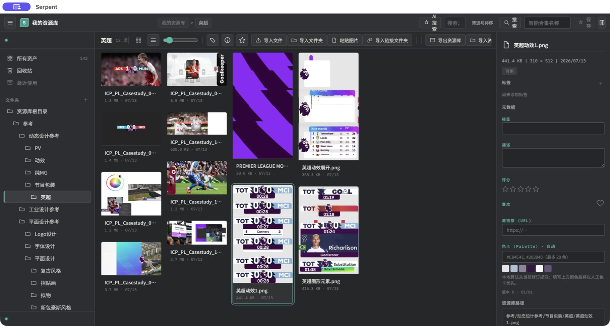
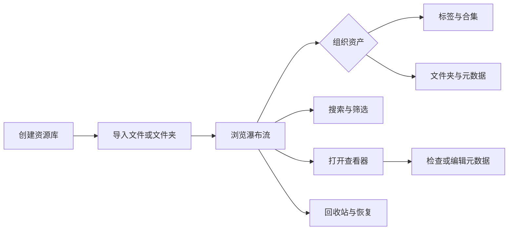

# 使用手册

面向最终用户的 Serpent 使用指南。英文版：[README.en.md](README.en.md)

- [安装](installation.md)——macOS / Windows 安装、浏览器扩展、升级
- [基本使用](basics.md)——创建资源库、导入、浏览、搜索、标签、合集、3D 查看器
- [插件、脚本与 MCP](extensions.md)——使用扩展的方法
- [故障排查](troubleshooting.md)——常见问题与解决

## 快速开始

1. 安装 Serpent（见[安装](installation.md)）
2. 启动应用，创建本地资源库
3. 把图片、视频、3D 模型拖入窗口，或点击「导入文件」
4. 资产出现在瀑布流中。双击查看大图或播放，右键查看更多操作

数据全部保存在本机资源库目录，无云端同步。

## 界面速览

典型工作区由左侧资源库导航、中部瀑布流画布和右侧 Inspector 组成；导入、筛选、排序等常用操作集中在顶部工具栏。

完整流程见[基本使用](basics.md)。

