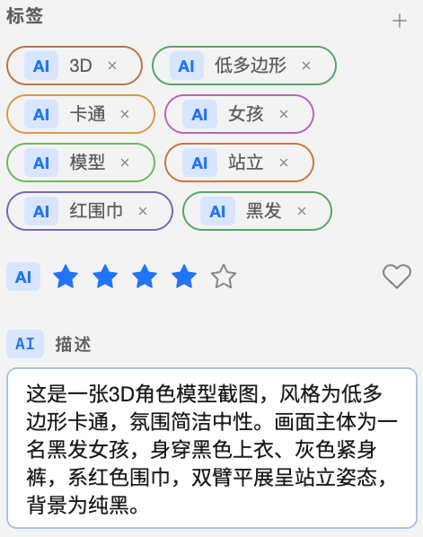

# AI analysis

## Scope and data boundary

Serpent’s AI analysis connects to a cloud AI service that you provide. Serpent does not provide an account, quota, or local model; enter the key supplied by your provider in Settings. The key is protected by the operating system and is not shown in the interface or normal logs. Read the disclaimer because the image, video contact sheet, or 3D view sheet sent to the provider may incur charges.

The Settings page supports several common AI services. Choose the connection type for your provider, enter its key and model name, and add a custom address if the provider requires one. Models can be loaded from the provider or entered manually.

## Configure AI

1. Open **Settings → AI**. On Windows use **Main menu → Settings**; macOS also exposes the same command in the native menu.
2. Choose an API format, enter the key and model, and add a custom Base URL if required.
3. Choose the output language (Chinese, English, Japanese, or Korean) and click **Test connection**.
4. Choose which fields AI may write: description, tags, and AI rating. You can also allow the model to use existing tags.
5. To analyze imports automatically, explicitly enable **Analyze new assets automatically**. It is off by default; without a valid key, model, and API format, imports are not queued.
6. Save. Advanced settings control concurrency (1–32, default 16), maximum image edge sent to the model (512–4096 px, default 2048), tag/description limits, output style, rating rubric, and custom prompts.

## Supported inputs

- Images and camera RAW: a resized image is sent.
- Video: Serpent creates a timestamped contact sheet and sends that sheet, not the original video.
- 3D models: Serpent renders a four-view sheet and sends it.
- Audio, text, and formats outside the image/video/model registries are not supported by AI analysis.

## Automatic and manual analysis

After import, jobs are queued in the background only when an API format and key are configured and the automatic-analysis switch is on; an empty model name or invalid provider configuration is reported when the job is processed. Browsing is not blocked. Images are processed from the source when possible and fall back to a ready thumbnail only when source decoding fails; videos require a contact sheet and 3D models require a view-sheet derivative. If a derivative is not ready, refresh media previews and run the analysis again. If the app restarts during the derivative-ready event, retry the job from Background jobs.

For a manual run, choose **AI analysis** from an asset context menu or use the batch action for a multi-selection. **Analyze unanalyzed assets** skips assets that already have AI content. Choosing the normal action again deliberately re-queues an existing result; a successful run atomically replaces the previous result and does not keep history.

AI writes a separate description, tag, and rating layer. Human-entered values and tags remain authoritative and are never overwritten. AI and human tag relationships are stored separately but can both be visible on an asset. Clear AI content can target one asset, the current selection, a folder, or the whole library; batch clearing asks for confirmation and does not delete human metadata or tag entities.

## Jobs, failures, and retry

Open **Window → Background jobs** to see queued, running, paused, failed, and completed AI jobs. You can pause/resume the AI queue, cancel it, retry failed items, and open diagnostics.

Network, rate-limit, timeout, and some invalid-response failures are retried according to the reliability policy. Authentication, permission, quota, and unsupported-format failures need a configuration or source-file fix. Failure messages include a short reason; partial failures are non-blocking notices, while a fully failed batch may show a more prominent failure message without discarding completed results. If a video contact sheet or thumbnail failed, retry media generation before retrying AI.

## Privacy and cost

Serpent does not upload an entire library and does not expose AI search. Only explicitly queued, supported assets are sent to the selected third-party vendor. Consider the vendor terms, data sensitivity, and cost limits before enabling it. Never put an API key in a script, plugin, or MCP payload.
