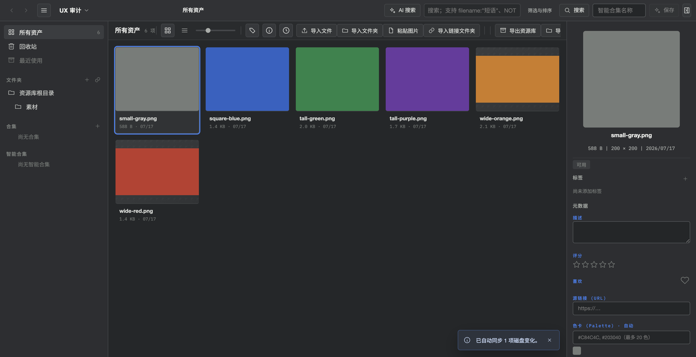
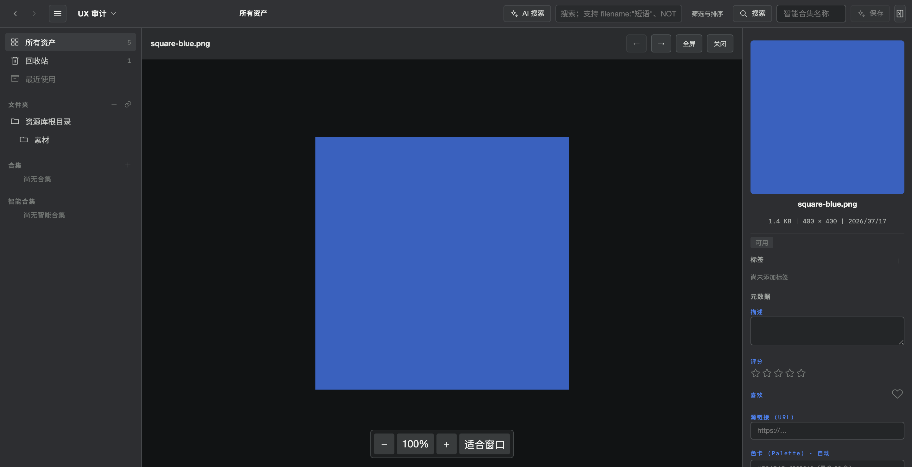

# Basics

## Create a library

On first launch the create dialog appears:

1. Pick a location
2. Enter a name and click Create

The library directory contains `Assets/` and `.serpent/`. Use the library menu to create, open or switch libraries.

## Import

Supported formats: images, video, audio, 3D models (FBX/OBJ/GLB/STL and more), text, RAW.

- Drag files or folders into the window (folders import recursively)
- Click Import Files or Import Folder
- Browser extension: right-click a web image/video and save, or drag it in

Files are copied into the library's `Assets/` directory and get a stable asset identity. Name or content conflicts open a dialog — choose how to proceed.

## Browse

- Sidebar: All assets, Trash, Tag management, Folders, Collections, Smart collections
- Toolbar: format filters (image/video/audio/3D/text), size filters, sorting
- Cards show a thumbnail and file name. Hover to preview, click to select, double-click to open the viewer
- Marquee select by dragging; multi-select with ⌘/Ctrl+click. Batch actions (rating, tags, …) work from the Inspector

After selecting an asset, the Inspector stays visible with metadata and editing controls for the current selection.

## Search

The search box supports keyword search across: file name, tags, description, source URL, author, folder path, metadata. Click `?` next to the box for syntax. Search combines with format, size, rating and tag filters.

## Tags and collections

- Tags: add from the Inspector or context menu; manage them in Tag management
- Collections: manual collections (drag assets in); smart collections aggregate by search criteria and update automatically

## Inspector

The right panel shows file info (name, size, dimensions, modified time, path), tags, rating, favorite, description, source link, author, technical info (format, codecs, color space) and AI analysis when available.

## 3D viewer

Double-click a 3D model to open it.

- Left-drag rotates, scroll zooms, middle-click dollies; right-drag rotates the HDRI light source (Ctrl+left-drag too)
- Toolbar: HDRI environment presets (4 Poly Haven sets), light intensity, preview mode, display mode
- FBX goes through the built-in conversion pipeline (ufbx → GLB) with PBR materials

The viewer keeps the Inspector visible so you can move between previewing an asset and checking its metadata.

## Trash

Deleted assets go to Trash and stay for 30 days — restore or purge them there. Folders and collections behave similarly.

## Shortcuts

| Action | macOS | Windows |
| --- | --- | --- |
| Open (viewer) | Enter | Enter |
| Open in external app | ⌘O | Ctrl+O |
| Reveal in folder | ⌘⇧S | Ctrl+Shift+S |
| Focus search | ⌘F | Ctrl+F |
| Rename | F2 | F2 |
| Move to trash | ⌘⌫ | Delete |
| Delete from disk | ⌥⌘Delete | Shift+Delete |
| Copy / Paste | ⌘C / ⌘V | Ctrl+C / Ctrl+V |
