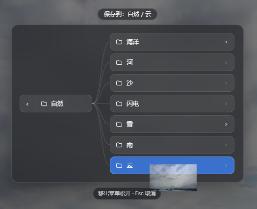

# Plugins, scripts, and MCP

Serpent has three extension mechanisms. This page covers using and managing them; see the [extension author manual](../manual/README.md) to build one.

## Plugins

Plugins can contribute menus, toolbars, settings pages, shortcuts, Inspector/viewer actions, custom views, jobs, and providers. Open **Settings → Plugins**. With no library open you can still manage user-wide plugins, but library-scoped plugins require an open library.

### Install

1. Open **Settings → Plugins** and choose Install.
2. Pick a scope:
   - **User-wide**: stored in the current user profile and available to every library; it is not synced with a library.
   - **Library**: stored in the library’s `.serpent/plugins` directory and can travel with the library; each device must trust it separately.
3. Choose a local plugin folder or ZIP, or enter a GitHub `owner/repository`, full repository URL, or Release URL.
4. The manager validates and reloads the package. Installation places files; it does not execute package install scripts.

GitHub installation prefers a platform ZIP from Releases and falls back to a repository ZIP when necessary. A package must contain `serpent-plugin.json` and built JavaScript; Serpent does not run `npm install` or build commands for it.

### Enable, trust, and disable

Turn on **Enable** on a plugin card. User-wide packages are trusted automatically; the first enable of a library package on a device asks for trust and can be declined. If user-wide and library versions share an ID, choose which version to use or disable the plugin.

There are two runtime modes:

- **restricted**: a QuickJS isolated runtime with no Node, filesystem, network, shell, SQLite, or host-DOM access; it can only call declared Serpent APIs.
- **unrestricted**: a separate Node UtilityProcess with Node.js, filesystem, network, and child-process capabilities. Manifest permissions still gate Serpent Gateway calls, but they are not a security sandbox; enable only code you fully trust.

Safe Mode pauses only unrestricted plugins; restricted plugins can continue to run. A changed permission, runtime mode, or source requires confirmation before enabling again.

### Update, reload, and uninstall

- GitHub auto-update is off by default. Enabling it requires confirmation and applies only to GitHub sources.
- Reload a package from its card without restarting Serpent.
- Uninstall removes the package and lock entry but **does not automatically delete plugin data**. User-wide data lives under `plugin-files/<pluginId>` and `plugin-storage/<pluginId>/user.json`; library data lives under `.serpent/plugin-files/<pluginId>` and `.serpent/plugin-data/<pluginId>.json`. Back up first, then remove those data directories manually if you need a full cleanup.

Local ZIPs are limited to 256 MiB, 10,000 files, 64 MiB per file, and 512 MiB extracted size. ZIP entries must be relative POSIX paths with no traversal, absolute path, or symlink.

## Automation scripts

Scripts are for one-off or saved batch operations such as assigning tags, ratings, or folders. With a library open, choose **More tools → Automation scripts** to open the Desktop Console. Create or open a `.serpent.js` / `.serpent.ts` file and run it.

Scripts run in a one-shot QuickJS sandbox. `serpent` and `console` are injected; Node, `require`, arbitrary filesystem, network, shell, SQLite, environment variables, `eval`, `Function`, and host DOM are unavailable. Only the controlled `serpent.ui.notify` toast can project a non-blocking message. Domain operations go through the Gateway and explicit library context. Each run has a 60-second wall-clock, 10-second CPU, 64 MiB memory, 1 MiB output, four concurrent Gateway calls, and 128 pending-Promise budget. There is no `serpent run` or `repl` CLI.

## MCP

MCP (Model Context Protocol) is a local connection for an external agent or MCP host. It is not a remote service and does not require Node, npm, or `npm run mcp`.

### First connection

1. Open **Settings → MCP** and enable **MCP service**.
2. Optionally enable **Auto-start**, or click **Start**. The default port is `47342`; after stopping the service you can change it to `1024–65535`.
3. Choose a config format (generic JSON, Claude, Cursor, Codex, or endpoint + token) and click **Add client**. Serpent creates a credential and copies the endpoint plus Bearer token to the clipboard; the token is shown only when created.
4. Paste the configuration into the target client. The service listens only on `127.0.0.1:<port>/mcp`.

### Permissions and security

Each credential starts in **Auto**: ordinary and recoverable operations run directly, while dangerous operations require a one-time Agent challenge. **Full Access** lets a trusted client run more ordinary operations directly, but it still cannot bypass dangerous-operation confirmation; plugin MCP commands are visible only to Full Access clients. Plugin MCP exposure is off by default and must be enabled command by command in plugin settings.

Library-scoped calls must include an explicit `libraryId`; they never use the currently focused library implicitly. Plugin tools also require asset, folder, or collection IDs. MCP exposes no arbitrary shell, SQL, filesystem, or public-network access.

Revoke credentials you no longer need in Settings; the old token stops working immediately. Request bodies, connections, initialization, and idle sessions are bounded. See the [MCP development guide](../manual/mcp/development.md) for the protocol contract.

## Which one to use

- Menus, settings pages, toolbar/viewer entries, or custom UI: **plugin**
- Saved one-off batch work: **automation script**
- An external agent or MCP host calling Serpent: **MCP**

Full authoring guides and API references are in the [extension author manual](../manual/README.md).
