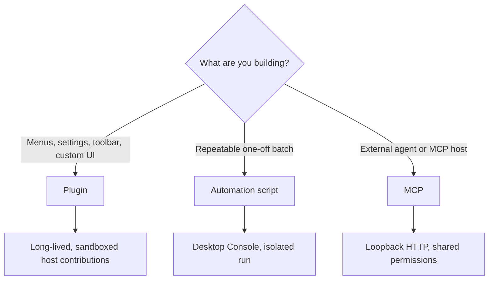

# Plugins, Scripts and MCP

Serpent offers three extension mechanisms. This chapter covers **using** them; writing extensions is in the [extension author manual](../manual/README.md).

## Plugins

Plugins are long-running extensions: menus, toolbars, settings pages, shortcuts, custom views. They stay resident after install and are managed in the plugin manager.

**Install**: get a plugin package (a folder or zip containing `serpent-plugin.json` + code) and install it from the app's plugin management entry. Install scope is either user-wide (all libraries) or library-wide.

**Manage**: the plugin manager enables / disables / uninstalls. Plugins run sandboxed — no direct database or arbitrary filesystem access.

## Automation scripts

Scripts are one-shot batches that run in the Desktop Console. Good for repeated operations: batch tags, batch ratings, folder cleanup.

**Open the Console**: with a library open, menu "More tools → Automation scripts".

**Run**: write or load a `.serpent.js` / `.serpent.ts` script in the Console and run it. Scripts use the `serpent` API to operate on the library (search, tags, ratings, folders, …). Each run is an isolated sandbox — variables from the previous run do not persist.

**Limits**: scripts are not Node programs — no arbitrary filesystem, network, shell or SQL access; only the `serpent` domain API.

## MCP

MCP (Model Context Protocol) lets an external agent or MCP host drive Serpent.

**Connect**: enable and start MCP in Serpent Settings, then use the copied endpoint and credential to connect an external Agent or MCP Host over loopback Streamable HTTP. The client does not need Node.js or npm installed.

**Capabilities**: the same operations as scripts (search, tags, ratings, folders, collections, …); writes are gated by configuration and high-risk confirmations.

**Limits**: the service binds only to `127.0.0.1`, so it is not a remote service; it provides no arbitrary shell, SQL, filesystem, or network access. Desktop Settings controls startup, automatic startup, and credential revocation.

## Which one to use

- Menus, settings pages, toolbar, viewer entries or custom UI: **plugin**
- One-shot batches, saved scripts: **automation script**
- External agent or MCP host: **MCP**

Full authoring guides and API references are in the [extension author manual](../manual/README.md).

