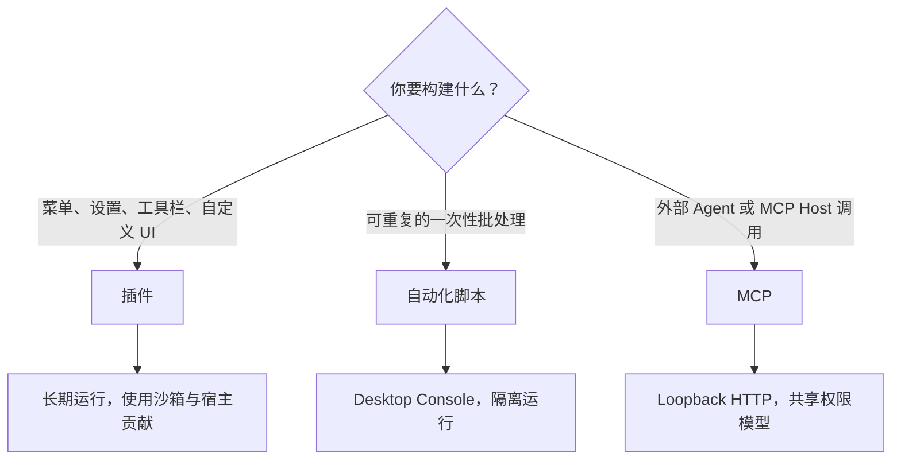

# 插件、脚本与 MCP

Serpent 提供三种扩展方式。本章讲**怎么用**；编写扩展见[扩展作者手册](../manual/README.md)。

## 插件

插件是长期运行的扩展：菜单、工具栏、设置页、快捷键、自定义视图等。安装后常驻，可在插件管理器中管理。

**安装**：获取插件包（`serpent-plugin.json` + 代码的文件夹或 zip），在应用的插件管理入口选择安装。安装范围分为用户级（所有资源库可用）与库级（仅当前资源库）。

**管理**：插件管理器可启用/禁用/卸载；插件沙箱与宿主隔离，不能直接访问数据库或任意文件系统。

## 自动化脚本

脚本是一次性的批处理，在 Desktop Console 中运行。适合重复操作：批量加标签、批量评分、整理文件夹等。

**打开 Console**：打开资源库后，菜单「更多工具 → 自动化脚本」。

**运行**：在 Console 中编写或加载 `.serpent.js` / `.serpent.ts` 脚本，点击运行。脚本通过 `serpent` API 操作资源库（搜索、标签、评分、文件夹等）。每次运行是独立沙箱，上一次运行的变量不保留。

**边界**：脚本不是 Node 程序——没有任意文件系统、网络、Shell 或 SQL 访问，只能使用 `serpent` 提供的领域 API。

## MCP

MCP（Model Context Protocol）让外部 Agent 或 MCP Host 接入 Serpent 执行操作。

**接入方式**：在 Serpent 设置中允许并启动 MCP 后，外部 Agent 或 MCP Host 使用页面复制的 endpoint 和 credential，通过本机 loopback Streamable HTTP 与当前 Desktop 通信。客户端不需要安装 Node.js 或 npm。

**能力**：与脚本共用同一套操作（搜索、标签、评分、文件夹、合集等），写操作受配置与高风险确认控制。

**边界**：服务只绑定 `127.0.0.1`，不是远程服务；不提供任意 Shell、SQL、文件系统或网络访问。MCP 服务的启停、自动启动和 credential 撤销都由 Desktop 设置控制。

## 三种方式怎么选

- 需要菜单、设置页、工具栏、查看器入口或自定义 UI：**插件**
- 一次性批处理、可保存的脚本：**自动化脚本**
- 外部 Agent 或 MCP Host 调用：**MCP**

编写扩展的完整指南与 API 参考见[扩展作者手册](../manual/README.md)。

