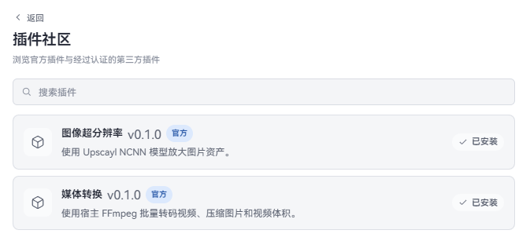

# Plugin features

Plugins add tools, menus, or workflows to Serpent. They are not ordinary library assets and can be enabled or disabled at any time.

## Install a plugin

Install official and certified third-party plugins from the plugin community:

1. Open **Settings → Plugins** and choose **Browse community**.
2. Browse or search. Click a card to see the author, version, repository, and readme; click **Install** and choose **User-wide** or **This library**.
3. After installation, return to the plugin list. Non-restricted plugins still need an explicit trust decision before they run.

A user-wide plugin is available in every library; a library plugin is used only in the current library.

Local folders, local ZIP archives, and GitHub URLs you paste yourself use **Advanced install** on the same page:

1. In **Settings → Plugins**, choose **Advanced install**.
2. Pick a built plugin folder or ZIP, or paste a GitHub repository / Release URL. For example:

   `https://github.com/dolag233/Serpent-Plugin-ImageUpscaler`

3. Choose **User-wide** or **This library** in the same way.

The plugin appears in the plugin list after installation. Follow the plugin author’s own instructions if it needs additional setup.

## Enable and disable

- Turn on **Enable** on the plugin card.
- The first time you enable a library plugin, Serpent asks whether you trust it. Only approve a source you trust.
- Turn **Enable** off whenever you do not need the plugin.
- Click **Reload** after changing plugin settings; Serpent does not need to restart.

If the same plugin is installed both user-wide and in the library, the plugin list shows which version is active and lets you switch or disable it.

## Update and uninstall

GitHub plugins can check for updates from plugin settings. Automatic updates are off by default; confirm the source before enabling them. Plugins installed from the community do not follow the latest GitHub Release by themselves; update them from the community page after the directory lists a new version.

Uninstalling a plugin does not remove personal settings it may have saved. Reinstall it later if you want to keep those settings; if the plugin provides its own cleanup action, prefer that action.

## If a plugin does not work

Check that it was installed in the intended scope, then reopen plugin settings. If it still does not work, contact the plugin author with your Serpent version, operating system, and plugin name. Never include an API key or other private data in a report.

Developers should read the [extension author manual](../manual/README.md).
