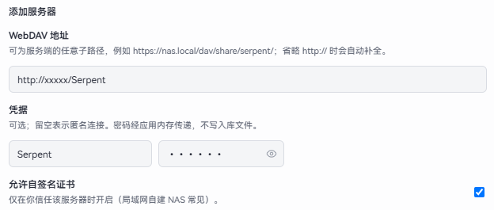
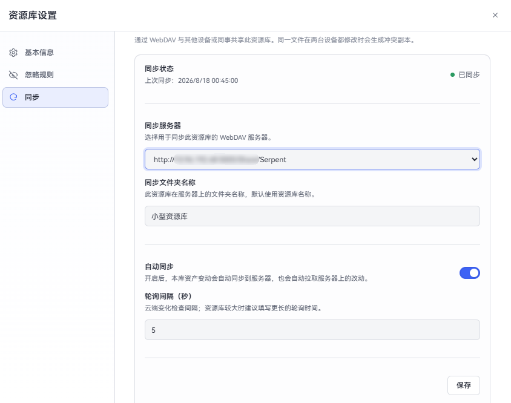
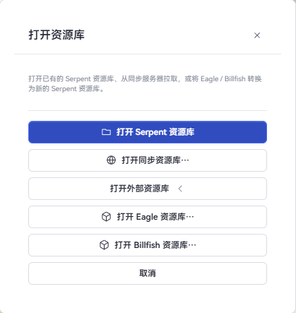

# 同步与外部资源库

Serpent 支持通过 WebDAV 服务器双向同步资源库，也可以直接打开 Eagle / Billfish 等外部资源库。

## 同步概览

- 在**通用设置**里配置一个或多个 WebDAV 服务器；每个资源库单独绑定服务器与远端文件夹。
- 同步是双向的：本地导入、修改或删除资产会自动上传；云端变化会自动拉取到本地。
- 自动同步按库开启：保存绑定后立即同步一次，之后按设置的轮询间隔检查云端变化；本地资产变更约 10 秒后自动上传。
- 同步进行中或完成时，右下角会出现 toast 提示；左上角资源库切换器旁显示连接状态图标（绿色链接 = 自动同步开启，灰色断开 = 未开启，悬停可见说明）。

## 配置 WebDAV 服务器（全局设置）

打开「通用设置」→「同步」，添加同步服务器：

- **服务器地址**：以 `http://` 或 `https://` 开头，可填写 NAS 或共享目录的 WebDAV 路径（例如 `https://nas.local/dav/share/`）。
- **用户名 / 密码**：服务器凭据。密码经系统安全存储加密保存（macOS 钥匙串 / Windows DPAPI），不会明文落盘。
- **允许自签名证书或 HTTP**：自建服务器未配置正式证书时勾选此项。
- 保存后可测试连接；连接失败会给出可读原因（地址无效、DNS、TLS、认证等）。

## 绑定资源库（资源库设置）

打开「资源库设置」→「同步」：

- **同步状态**：显示未同步 / 同步中 / 上次同步时间。
- **服务器**：选择该资源库绑定的服务器；切换时自动测试连接。
- **同步文件夹名**：远端目录名，默认与资源库同名。
- **自动同步**：开启后本地变更自动上传、云端变化自动拉取。
- **轮询间隔（秒）**：云端变化检查频率，默认 5 秒。**资源库较大时建议填写更长的轮询时间**，避免频繁检查拖慢网络与磁盘。
- **保存**：保存绑定；开启自动同步时会立即触发一次同步。

## 打开同步资源库

「打开资源库」→「打开同步资源库…」：

1. 选择已配置的服务器；
2. 面板列出该服务器上的同步库（按远端清单识别，可跨设备继续使用）；
3. 选择目标保存位置后打开，远端内容下载到本地。

## 打开外部资源库（Eagle / Billfish）

「打开资源库」→「打开外部资源库…」→ 选择 **Eagle** 或 **Billfish**：

1. 选择源库（Eagle/Billfish 的资源库目录或其归档压缩包）；
2. 选择 Serpent 的保存位置；
3. Serpent 会转换源库并在目标位置创建本地库，转换期间显示进度（大型 Eagle 库首次转换可能需要数分钟，期间可继续等待或取消）。

转换完成后，浏览、搜索、标签、AI 分析等体验与本地资源库一致，原库文件不会被改动。

